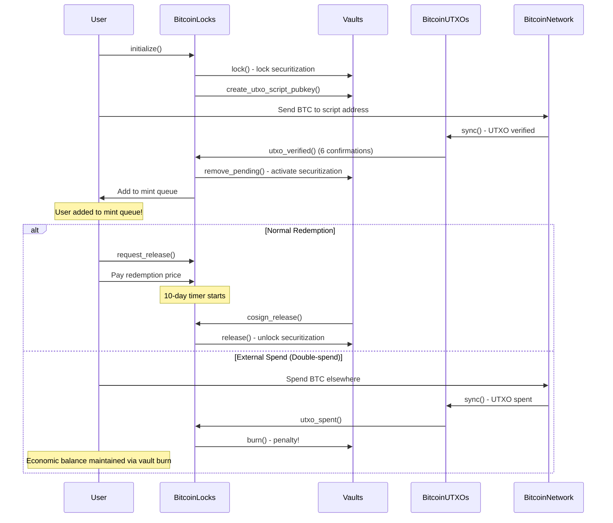

# Bitcoin Locks: Technical Flow Documentation

This document explains how bitcoin locks work in the Argon protocol - a system that allows users to
lock Bitcoin and mint equivalent Argons (the stablecoin), creating a Bitcoin-backed minting
mechanism through vault securitization.

## Concept Overview

### What is a Bitcoin Lock?

A bitcoin lock is essentially a **Bitcoin-backed minting mechanism**:

1. **User deposits Bitcoin** → **Receives newly minted Argons** (stablecoin)
2. **User can redeem Bitcoin** by paying back Argons + fees
3. **If user spends Bitcoin outside the system** → They've double-spent (got Argons + spent Bitcoin)

The system is backed by **vaults** - entities that provide securitization capacity and earn revenue
primarily from liquidity pool participation in mining bid distributions.

### Key Players

- **Bitcoin Holder**: Wants to unlock liquidity from their Bitcoin without selling it
- **Vault Operator**: Provides securitization capacity, earns liquidity pool revenue from mining bid
  distributions
- **Network**: Monitors Bitcoin network to detect if users spend their locked Bitcoin elsewhere

## Complete User Workflow

### Phase 1: Creating a Lock

1. **User chooses a vault** with acceptable terms (fees, rates)
2. **User calls `initialize()`** on-chain with lock details
3. **Bitcoin script address generated** using combined keys (user + vault + timelock)
4. **User sends Bitcoin** to this special address
5. **Vault securitization locked** but not yet activated

### Phase 2: Activation (Bitcoin Network Verification)

1. **Off-chain monitoring** detects Bitcoin transaction in mempool/blocks
2. **Bitcoin reaches 6 confirmations** on the Bitcoin network
3. **Network verifies** the Bitcoin matches the lock details (amount, script, etc.)
4. **`utxo_verified` event** triggers lock activation
5. **User added to mint queue** to receive newly minted Argons
6. **Vault securitization moves** from "locked" to "activated" state

### Phase 3: Termination (Multiple Paths)

#### Path A: Normal Redemption

1. **User calls `request_release()`** with pre-signed Bitcoin transaction
2. **User pays redemption price** in Argons (current market rate, capped at original lock price)
3. **Vault operator calls `cosign_release()`** within 10 days to co-sign the Bitcoin transaction
4. **Bitcoin is released** to user, vault securitization unlocked

#### Path B: Ratcheting (Price Adjustment)

1. **User calls `ratchet()`** to adjust Argon amount based on current Bitcoin price
2. **Price check**: Current BTC/Argon rate must differ from original lock price
3. **Two scenarios**:
   - **Price Up**: User gets additional Argons (difference between new and old price)
   - **Price Down**: User pays redemption price, burns original Argons, gets new amount at current
     rate
4. **Lock updated** with new lock price, Argon balance adjusted

#### Path C: Lock Expiration (365 days)

1. **Lock expires** after 365 days if not redeemed
2. **Vault securitization burned** to balance system books (Argons were minted, Bitcoin backing
   lost)
3. **User loses access** to their Bitcoin after grace periods

#### Path C: External Spend (User Double-Spends)

1. **User spends Bitcoin** outside the system (on Bitcoin network)
2. **Network detects** the spend via off-chain monitoring
3. **`utxo_spent` event** triggers penalty
4. **Vault securitization burned** to balance system books (prevents system loss)
5. **Assumption: Vault-user collusion** - system treats this as coordinated theft
6. **Economic balance maintained**: Argons were minted, Bitcoin backing lost, securitization burned
   to offset

#### Path D: Vault Operator Failure (Failed Co-signing)

1. **User requests release** but vault operator fails to co-sign within 10 days
2. **User's redemption payment returned** (service not delivered)
3. **User compensated from vault securitization** up to vault's securitization ratio (e.g., 2x
   original lock price)
4. **If Bitcoin > securitization ratio**: User only gets ratio amount, not full current value
5. **Vault loses capacity** for future Bitcoin locks

## Technical Implementation: Cross-Pallet Architecture

### Core Pallets

#### 1. **Vaults Pallet** (`pallets/vaults`)

- **Purpose**: Manages vault securitization capacity and operators
- **Key Storage**:
  - `VaultsById` - Vault configuration and fund tracking
  - `VaultXPubById` - Bitcoin key management for script generation
- **Fund Management**:
  ```rust
  // Available securitization = total - locked - fees
  vault.available_for_lock() = securitization - argons_locked
  ```

#### 2. **Bitcoin Locks Pallet** (`pallets/bitcoin_locks`)

- **Purpose**: Manages lock lifecycle and user interactions
- **Key Extrinsics**:
  - `initialize()` - Create new lock, reserve vault funds
  - `request_release()` - User requests Bitcoin back
  - `cosign_release()` - Vault operator co-signs Bitcoin transaction
- **Key Storage**:
  - `LocksById` - Individual lock details and state
  - `LockReleaseRequestsByUtxoId` - Tracks release requests awaiting co-signature

#### 3. **Bitcoin UTXOs Pallet** (`pallets/bitcoin_utxos`)

- **Purpose**: Bridges off-chain Bitcoin monitoring with on-chain state
- **Key Extrinsic**:
  - `sync()` - Processes Bitcoin network events (verified/spent/invalid UTXOs)
- **Events Triggered**:
  - `UtxoVerified` → Activates pending locks
  - `UtxoSpent` → Triggers vault penalties
  - `UtxoRejected` → Cancels pending locks

### Pallet Interaction Flow



## Ratcheting: Detailed Technical Flow

### What is Ratcheting?

Ratcheting allows users to **adjust their Argon position** when Bitcoin prices change, without
releasing the underlying Bitcoin. It's essentially a **virtual release/re-initialize cycle** that
provides the same economic outcome as unlocking Bitcoin and locking it again at the new price, but
without touching the Bitcoin network.

**Key advantages over traditional release/re-initialize:**

- **No Bitcoin network fees** - Saves on transaction costs
- **No confirmation delays** - Instant execution vs 6+ Bitcoin confirmations
- **Easy automation** - Single on-chain call vs complex Bitcoin operations
- **Practical volatility capture** - Enables frequent position adjustments

### Ratcheting Preconditions

```rust
fn ratchet(origin: OriginFor<T>, utxo_id: UtxoId) -> DispatchResult {
    // 1. Lock must exist and user must own it
    let mut lock = LocksByUtxoId::<T>::get(utxo_id).ok_or(Error::<T>::LockNotFound)?;
    ensure!(lock.owner_account == who, Error::<T>::NoPermissions);

    // 2. Lock must be verified (Bitcoin confirmed on-chain)
    ensure!(lock.is_verified, Error::<T>::UnverifiedLock);

    // 3. Lock must NOT be in release process
    ensure!(
        !LockReleaseRequestsByUtxoId::<T>::contains_key(&utxo_id),
        Error::<T>::LockInProcessOfRelease  // <-- THIS IS WHY BENCHMARKS FAILED
    );

    // 4. Price must have changed
    let new_lock_price = T::PriceProvider::get_bitcoin_argon_price(lock.satoshis)
        .ok_or(Error::<T>::NoBitcoinPricesAvailable)?;
    ensure!(original_lock_price != new_lock_price, Error::<T>::NoRatchetingAvailable);
}
```

### Ratcheting Scenario 1: Price Increase (Ratchet Up)

**Situation**: Bitcoin price increased from original lock price

**Flow**:

1. Calculate additional Argons owed: `new_price - original_price`
2. Calculate proportional vault fee based on time elapsed
3. Call `T::VaultProvider::lock()` for additional amount
4. Call `T::LockEvents::utxo_locked()` to mint additional Argons
5. Update lock with new price

**Cross-Pallet Operations**:

- **Vaults**: Additional securitization activated (partial duration fee)
- **Mints**: User added to mint queue for additional Argons
- **No burns or releases**

### Ratcheting Scenario 2: Price Decrease (Ratchet Down)

**Situation**: Bitcoin price decreased from original lock price

**Flow**:

1. Calculate redemption price for original amount
2. Call `T::LockEvents::utxo_released()` (burns from circulation)
3. **Burn user's Argons** equivalent to redemption price (`T::Currency::burn_from()`)
4. Call `T::VaultProvider::schedule_for_release()` for original amount
5. Call `T::VaultProvider::lock()` for new amount (with `satoshis: 0`, extension duration)
6. Call `T::LockEvents::utxo_locked()` to mint new amount
7. Update lock with new price

**Cross-Pallet Operations**:

- **Currency**: Burn user's Argons (`T::Currency::burn_from()`)
- **Mints**: Remove original amount from circulation, add new amount to mint queue
- **Vaults**: Release original securitization, activate new (smaller) amount

### Key Insight: Ratcheting State Requirements

**Critical**: Ratchet can only happen when lock is in **stable verified state**:

- ✅ Lock exists and is verified
- ✅ NOT in pending release state (checked via `LockReleaseRequestsByUtxoId` storage)
- ✅ Price has changed

**This explains the benchmark failures**:

- My benchmarks were setting up `pending_release` state first
- But ratchet explicitly **rejects** locks in release process!
- Proper setup: verified lock with **no release request**

### Economic Analysis: Why Ratcheting Exists

**Problem 1**: Bitcoin price volatility makes fixed-price locks economically inefficient **Problem
2**: Fixed locks create securitization inefficiencies and vault failure exposure

**Examples**:

- **User locks 1 BTC at $40k** → Gets 40,000 Argons, 2x securitization = $80k backing
- **Bitcoin rises to $80k** → Still only $80k backing for $80k Bitcoin (1x, not 2x protection)
- **Bitcoin falls to $20k** → 4x over-securitized ($80k backing for $20k Bitcoin)

**Solution**: Ratcheting maintains optimal securitization ratios while capturing volatility profits,
providing the economic equivalent of release/re-initialize cycles without Bitcoin network complexity

### Detailed Economic Flows

#### Ratchet Up Economics (Bitcoin Price Increased)

**Initial State**: User locked 1 BTC at $40k → 40,000 Argons **Current State**: Bitcoin now worth
$60k **User Action**: Call ratchet()

**Economic Flow**:

1. **Calculate difference**: $60k - $40k = $20k additional value
2. **Add to mint queue**: User queued to receive additional 20,000 Argons
3. **Vault securitization activated**: Additional securitization capacity activated for 20,000
   Argons
4. **Fee calculation**: Proportional fee based on `elapsed_blocks / full_term` ratio for additional
   amount

**Result**: User now has 60,000 Argons backed by 1 BTC worth $60k

#### Ratchet Down Economics (Bitcoin Price Decreased)

**Initial State**: User locked 1 BTC at $70k → received 70,000 Argons **Current State**: Bitcoin now
worth $40k **User Opportunity**: Only needs 40,000 Argons to unlock Bitcoin, can keep the difference
**User Action**: Call ratchet() to capture profit

**Economic Flow**:

1. **User pays redemption cost**: Burns 40,000 Argons (current unlock price) from user balance
2. **System circulation burn**: Remove original 70,000 Argons from total supply via
   `T::LockEvents::utxo_released()`
3. **Vault securitization adjustment**: Release original securitization, activate new amount for
   current Bitcoin value
4. **New lock at current rate**: Activate vault securitization for $40k worth (40,000 Argons)
5. **Add to mint queue**: User queued to receive 40,000 Argons

**Economic Benefits**:

1. **Profit extraction**: User keeps 30,000 Argons profit (70k - 40k = 30k difference)
2. **Right-sized securitization**: Now has proper 2x backing ($80k) for $40k Bitcoin
3. **Freed capacity**: Vault can use released securitization for other locks
4. **Future flexibility**: Can ratchet up efficiently from proper baseline

**Result**: User has 30,000 Argons profit + 40,000 Argons from new lock + same 1 BTC + optimal
securitization ratio

**Automation Benefits**: Single on-chain calls enable automated strategies to capture every
profitable price movement without Bitcoin network complexity

**Future Upside**: From right-sized position, can efficiently capture gains as Bitcoin rises through
simple, automatable ratcheting operations

### Redemption Price Formula Economics

The `get_redemption_price()` function implements a **penalty curve** based on Argon's deviation from
target price:

```rust
// r = argon_current_price / argon_target_price
let r = T::PriceProvider::get_redemption_r_value().unwrap_or(FixedU128::one());

// Case 1: r ≥ 1.0 (Argon at/above target) → No penalty
price = bitcoin_market_price.min(original_lock_price)

// Case 2: 0.90 ≤ r < 1.0 (Mild deviation) → Quadratic penalty
price = bitcoin_market_price * (20r² - 38r + 19)

// Case 3: 0.01 ≤ r < 0.90 (Moderate deviation) → Linear penalty
price = bitcoin_market_price * ((0.5618r + 0.3944) / r)

// Case 4: r < 0.01 (Extreme deviation) → Aggressive penalty
price = (bitcoin_market_price / r) * (0.576r + 0.4)  // Note: 0.576 = 576/1000
```

**Economic Purpose**:

- **Creates automatic stabilization** - the worse Argon performs, the better the redemption deal
  becomes
- **Incentivizes buying and burning Argons** exactly when the system needs it most
- **Self-correcting mechanism** - harnesses greed to fix oversupply problems

### Vault Economics in Ratcheting

**Vault Revenue Sources**:

1. **Liquidity pool revenue** (80% of mining bid distributions) - Primary revenue
2. **Bitcoin lock fees** - Annual rate + base fees
3. **Ratcheting fees** - Proportional fees on additional locks

**Vault Risk Management**:

- **Securitization ratio** (typically 200%) provides buffer against Bitcoin volatility
- **Ratcheting helps vaults** by keeping securitization active and revenue-generating during price
  changes
- **Failed cosigns burn vault securitization** - Major penalty encouraging good behavior

### Cross-Pallet Weight Implications

**Ratchet Up** (lighter operation):

- Single vault lock operation (`T::VaultProvider::lock()`)
- Single mints operation (`T::LockEvents::utxo_locked()`)
- No burns or releases
- **Weight**: ~40-50% of full initialize

**Ratchet Down** (heavier operation):

- Currency burn operation (`T::Currency::burn_from()`)
- Mints circulation burn (`T::LockEvents::utxo_released()`)
- Vault release operation (`T::VaultProvider::schedule_for_release()`)
- Vault lock operation (`T::VaultProvider::lock()` for new amount)
- Mints circulation add (`T::LockEvents::utxo_locked()`)
- **Weight**: ~80-90% of full initialize + release cycle

## Economic Model: Incentives and Penalties

### Vault Economics

**How vaults make money:**

1. **Liquidity pool revenue** (biggest source) - Share of mining bid distributions based on
   activated securitization
2. **Bitcoin lock fees** - Direct fees from users who lock Bitcoin
3. **Faster capital cycling** - Can reuse securitization immediately when users redeem early

**Economic balance maintained:**

- **System designed for zero-sum outcomes** - no one gets "free" money
- **All scenarios net to economic balance** through securitization management
- **Vault protection**: Securitization ratios (e.g., 2x) provide buffer against losses

**Vault securitization burns (system balancing):**

- **External Bitcoin spends**: Securitization burned to offset system loss
- **Lock expirations**: Securitization burned to balance unused Bitcoin backing
- **Failed co-signatures**: Securitization used to compensate user up to ratio limit

### User Economics

**Users benefit from:**

- Immediate liquidity from Bitcoin without selling
- Capped redemption price (protection from Bitcoin price increases)
- Ability to extend locks if needed

**User trade-offs:**

- External spending → Keep Argons, lose Bitcoin (system balanced via vault burn)
- Lock expiration → Lose Bitcoin access (system balanced via securitization burn)
- Vault failure → Compensation limited to vault's securitization ratio

### Network Security

The system is secure because users face a **liquidity vs ownership trade-off**:

- Spend Bitcoin outside → Keep liquidity but lose Bitcoin redemption rights
- Keep Bitcoin locked → Maintain redemption option but pay ongoing costs

### How Vaults Actually Make Money

**Primary revenue: Liquidity pool revenue** (from mining bid distributions)

- Miners bid for mining slots, vault liquidity pools get 80% of winning bids
- Vault's share depends on their activated securitization (more activated Bitcoin locks = more
  liquidity pool revenue)
- This is where vaults make most of their money

**Secondary revenue: Bitcoin lock fees**

- Initialization fees and annual rates from users
- Much smaller than mining revenue but still meaningful

**Key insight: Bitcoin locks enable liquidity pool revenue**

- Each activated Bitcoin lock increases vault's capacity to earn from mining bid distributions
- More activated securitization = larger share of liquidity pool revenue
- Creates strong incentive for vaults to facilitate Bitcoin locks

**When users redeem early:**

- **Redemption payment is burned** (deflationary, not paid to vault)
- Vault gets their original securitization back for immediate reuse
- Doesn't lose liquidity pool revenue capacity
- Benefits from faster capital cycling only

**See**: [Mining and Liquidity Pool Economics](./MINING_LIQUIDITY_FLOW.md) for complete details.

## Redemption Pricing: The Economic Incentives

### How Much Users Pay to Get Their Bitcoin Back

The cost to redeem Bitcoin depends on two things:

1. **Current Bitcoin price vs original lock price** (user is always protected from paying more than
   they originally locked at)
2. **How well Argon is performing** (creates automatic market stabilization)

### The "Argon Health" Discount System

**When Argon is trading at target price** (r ≥ 1.0):

- Users pay normal redemption cost
- Just current Bitcoin price (capped at original lock price)

**When Argon is trading below target** (r < 1.0):

- Users pay **less in fiat value** to redeem their Bitcoin
- More Argons required, but each Argon costs less on market
- **Net effect**: Real fiat discount + automatic Argon burn exactly when needed

### Why This Works

**Example scenario: Argon drops 50% below target**

- User needs 2x more Argon tokens to redeem
- But each Argon costs 50% less to buy on market
- **Net result**: User pays less in fiat terms, more Argons get **burned**
- **Double benefit**: Buying pressure + supply reduction exactly when needed

**The magic**: System makes it profitable to fix Argon's problems automatically - someone always
will.

### Price Change Scenarios

**Bitcoin price goes up:**

- User protected by price cap - never pays more than original lock price
- Huge benefit if Bitcoin doubled, user still pays original amount

**Bitcoin price goes down:**

- User can "ratchet down" - pay redemption cost and get difference back
- Or just pay the new lower price when redeeming

**Argon gets stronger:**

- Users pay normal rates
- System encourages redemption when Argon is healthy

**Argon gets weaker:**

- Users get increasing discounts
- Creates counter-cyclical support exactly when Argon needs it

## Security Model: Collusion Resistance

### Core Assumption: Vault-User Collusion

The system is designed around the assumption that **any external Bitcoin spend represents vault-user
collusion**. This isn't paranoia - it's the only rational security model.

**Why assume collusion?**

- User could pressure vault: "Help me spend this Bitcoin or I'll claim you failed to co-sign"
- Vault could bribe user: "I'll split the profits if you let me spend your Bitcoin"
- Detection is impossible: System can't tell legitimate external spend from coordinated theft

**Solution: Treat all external spends as theft**

### Securitization as Economic Security

**Vault must put "skin in the game":**

- Securitization typically 1-2x the Bitcoin value they're backing
- **Gets burned permanently** if any Bitcoin is spent outside the system
- Creates loss that exceeds any potential theft gains

**System balancing scenarios:**

1. **External spend**: Vault securitization burned to offset system loss
2. **Failed co-signing**: Vault securitization used to compensate user up to ratio limit
3. **Lock expiration**: Vault securitization burned to balance unused Bitcoin backing

### Why This Works

**Economic math makes collusion unprofitable:**

- Vault securitization > potential theft gains
- User still loses Bitcoin redemption rights
- Network automatically detects and penalizes any external movement

**Economic balance example:**

- User has $50k Bitcoin lock, vault has $100k securitization backing it (2x ratio)
- If they collude: User gets $50k Argons + $50k Bitcoin, vault loses $100k securitization
- **System perspective**: $50k Argons minted, $50k Bitcoin lost, $100k securitization burned
- **Net result**: System remains balanced, collusion costs more than gains

**Honest behavior is economically rational** - vaults make more money long-term through legitimate
operations than they could steal through collusion.

## Bitcoin Network Integration

### Off-Chain to On-Chain Bridge

The system continuously monitors the Bitcoin network to detect state changes:

#### 1. **Off-Chain Monitoring** (`node/bitcoin_utxo_tracker/`)

- Uses Bitcoin RPC + block filters to track specific UTXOs
- Monitors for: confirmations (minimum 6), spends, invalidations
- Maintains local cache of Bitcoin network state

#### 2. **Inherent Data** (`get_bitcoin_inherent`)

- Each block, node provides `BitcoinUtxoSync` data to runtime
- Contains batch updates: `verified`, `spent`, `invalid` UTXO mappings
- Triggered automatically via inherent extrinsics (like timestamp)

#### 3. **On-Chain Processing** (`bitcoin_utxos::sync`)

- Processes batches of Bitcoin network events
- Updates on-chain UTXO storage
- Triggers cross-pallet events to `bitcoin_locks`

#### 4. **Lock Reactions**

- `utxo_verified` (6+ confirmations) → User added to mint queue, vault securitization activated
- `utxo_spent` → Vault securitization burn for system balance, user loses Bitcoin redemption
- `utxo_rejected` → Lock cancelled, vault funds returned

This creates a **real-time bridge** between Bitcoin network activity and Argon protocol state, with
verification requiring 6 Bitcoin network confirmations.

## Mints Pallet Integration: Circulation Management

### How Bitcoin Locks Affect Argon Supply

Every bitcoin lock lifecycle event updates Argon circulation through the **mints pallet**:

**When Bitcoin is locked and verified:**

- User is added to the mints queue via `mints::utxo_locked()`
- Vault accounting updated via `vault::remove_pending()` (activates securitization)
- User receives newly minted Argons when economic conditions permit: (1) Argon CPI ≤ 0, (2)
  Available mining mint capacity > current bitcoin mint allocation, (3) Queue processing occurs

**When Bitcoin is released/burned:**

- Mints pallet subtracts from `MintedBitcoinArgons` (decreases circulation)
- Amount removed = `min(original_lock_amount, current_economic_value)`

**Why the minimum calculation:**

- **Bitcoin price rose**: Only remove original amount (prevents over-deflation)
- **Bitcoin price fell**: Only remove current value (reflects actual economic loss)
- **Maintains system balance**: Argon circulation accurately reflects Bitcoin backing

This ensures that the total `MintedBitcoinArgons` always represents the real economic value of
Bitcoin currently backing the Argon supply.

---

## Related Technical Documentation

**Core System Flows:**

- [Mining Liquidity](./mining-liquidity.md) - Vault revenue distribution and frame transition
  operations
- [Notebook](./notebook.md) - L2 scaling architecture and cross-pallet event processing

**Development Resources:**

- [Benchmarking Guide](./benchmarking.md) - Complete benchmarking methodology and patterns
- [CLAUDE.md](../CLAUDE.md) - Project overview and development commands

**Integration Points:**

- **Vault Operations**: Securitization, funding, and revenue distribution
- **Mining Revenue**: Liquidity pool participation and bid pool distribution
- **UTXO Tracking**: Cross-pallet event coordination and Bitcoin network integration
- **L2 Scaling**: Notebook system for high-frequency transaction processing
