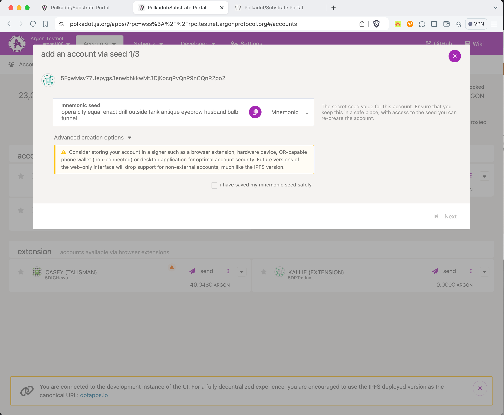
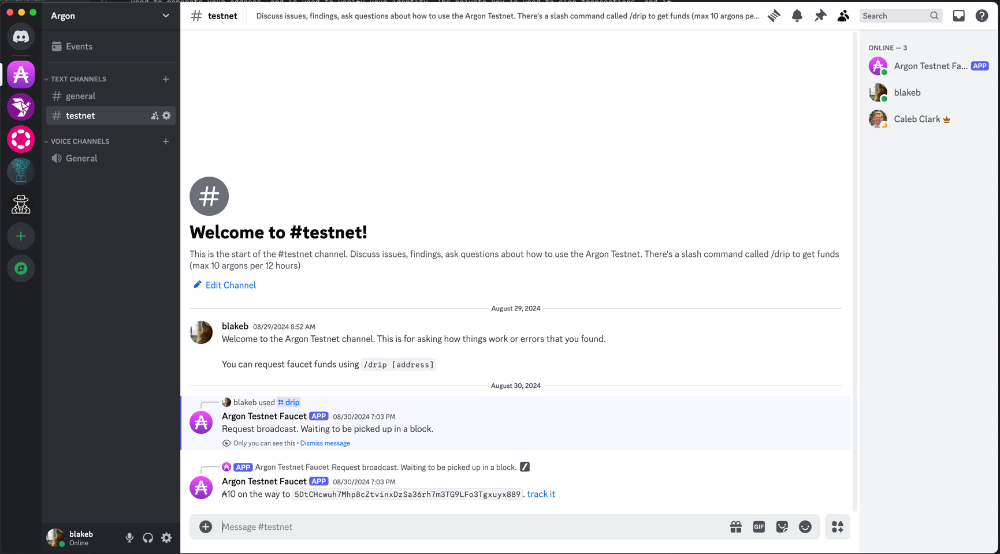

# Account Setup

An account in Argon is a cryptographic keypair that allows you to interact with the network. It's also used to generate
an address that can be used to send and receive funds. An account in Argon will transverse the Mainchain and
Localchains, allowing you to interact with the network in a variety of ways.

## Account Types

Argon accounts use either Ed25519 cryptography, or Sr25519 cryptography. The former is a more traditional elliptic curve
cryptography, while the latter is a Schnorr signature scheme that is more efficient and secure, allowing for heuristic
key derivation.

## Storage of Keys (background)

When you create an account, you will have two parts to your keypair: a public key and a private key. The public key is
used to generate your address, and is used to verify your identity. The private key is used to sign transactions, and if
someone else has access to it, they can spend your funds. For this reason, it's important to keep your private key
secure. There are a few ways to store your keys:

1. In a file on your computer (eg, local storage in your browser)
2. In a hardware wallet (
   e.g. [Ledger Nano S](https://www.ledger.com), [Polkadot Vault](https://wiki.polkadot.network/docs/polkadot-vault))
3. In a browser extension (
   e.g. [Polkadot.js extension](https://polkadot.js.org/extension/), [Talisman](https://www.talisman.xyz), Metamask)

The main difference is in how much control you have over your keys, and how secure they are. A file on your computer is
the least secure, but also the most convenient. A hardware wallet is the most secure, but also the least convenient. A
browser extension is somewhere in the middle.

When keys are not connected to the internet, this is called a *"cold wallet"* or *"cold storage"*. When keys are
connected to the internet in some form, this is called a *"hot wallet"* or *"hot storage"*. A hardware wallet is
considered a cold wallet, while a browser extension is considered a hot wallet.

### Testnet (reduced security)

For the testnet, it is recommended to use a browser extension or local storage in your browser. This is because the
testnet is not worth anything, so the security of your keys is not as important. However, you might choose to use a
hardware wallet to learn the preferred way to operate on the mainnet. The Ledger wallets support the Argon network via
the Polkadot.js interface.

## Connect to the Right Network

You can connect to any rpc url for a server or node that you trust. Some examples are:

- `Testnet`: `wss://rpc.testnet.argonprotocol.org`
- `Mainnet`: `wss://rpc.argon.network`

You'll see many urls with `?rpc=wss://rpc.testnet.argonprotocol.org` in the documentation. Replace this url with the
network you want to use (eg, `?rpc=wss://rpc.argon.network`.

## Creating an Account

You can create an account from the Mainchain, or using the Localchain. The end result is the same, so this is just a
preference of how you want to interact with the network (probably based on your first, or most common use-case).

### 1. Using the Polkadot.js interface

This a developer-centric interface that allows you to interact with Argon in a more visual way.

You can create an account using
the [Polkadot.js interface](https://polkadot.js.org/apps/#/accounts?rpc=wss://rpc.testnet.argonprotocol.org).

The Polkadot interface allows you to store accounts in a few different ways. You can use a browser extension, a hardware
wallet, or a mnemonic phrase that is stored inside your browser. Polkadot is security oriented, so they don't activate
the easiest (and least secure) option by default, which is to simply use local storage in your browser.

To activate local storage, you can go to the settings page and choose the "Allow local in-browser account storage"
option.
.

## Requesting Testnet Funds

The testnet faucet is a simple service that provides free testnet argons for testing purposes. NOTE: these are not worth
anything, so should not be used for anything other than testing.

Our Testnet Faucet is available in the [Argon Discord](https://discord.gg/6JxjCNvu6x). You can request testnet funds by
joining the Discord and typing `/drip [address]` in the `# testnet` channel, or direct messaging the bot.

You'll see the funds processing on the mainchain

