# Liquid Locking

Liquid Locking allows you to lock your Bitcoin in exchange for liquidity on the Argon Network. You retain ownership of
your Bitcoin via a multi-signature script pubkey that you are a co-custodian of. You can unlock your Bitcoin at any time
by "burning" the current market rate of your Bitcoins, but notably capped at the price at "lock time" (your lock price).

## Why do I want this for my Bitcoin?

The Argon Network produces an inflation-proof currency. If you are holding Bitcoin, locking them into an Argon
Stabilization Vault allows you to continue holding while unlocking the liquid worth of your Bitcoin. Since you can redeem your Bitcoin at
the market rate at time of unlock, you can protect yourself against price decreases in Bitcoin, and since it is capped
at the "lock price", you still benefit from price increases.

In addition to the Bitcoin prices, you can capitalize on variations in the Argon's price. If the Argon price falls, it
will be cheaper in relative terms to unlock your Bitcoin, allowing you to make a profit on the difference between the
market rate in local currency and the argon price. In addition, there is an early mover incentive to buy back first when
the Argon price falls, allowing an additional profit.

## Why does Argon do this?

Argon works by constantly adjusting the currency supply to match demand. In other words, there is a target Argon price
and if the price is below the target, there are too many argons in existence. If the price is above target, not enough
argons exist.

When a Bitcoin is locked into a Stabilization Vault, the equivalent amount of argons are locked as collateral for a year. This reduces
the argon supply, but it nets out to zero because the Bitcoin will gain rights to mint new argons. Eg, new argons minted
are equal to argon collateral.

However, to unlock my Bitcoin, I am required to _burn_ the unlock price from existence (the current market rate capped
at the lock price). If many people are wanting to move out of the Argon, the price will fall, and the increased number
of argons representing the market price of my Bitcoin will remove many more argons from circulation. This removes a
proportional amount of argons from the system, while costing the same amount of fiat currency to the Bitcoin holder.
Removing the excess currency allows the price to rise.

## Locking Flow

We'll show examples in this flow using Electrum. After you have opened Electrum, follow the flow to create a new wallet
or access your existing wallet.
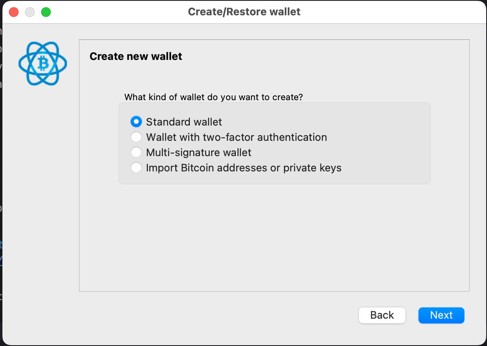

You'll need to acquire BTC or have some available that you will send to a multisig that you'll create with a Vault in
these steps.

### Testnet

#### Wallet connected to Signet

You'll need a bitcoin wallet that supports a custom Signet. NOTE: as explained below, Argon needs wallets that support
Miniscript, but they are currently limited and Bitcoin Core takes a good deal of disk space and several hours to sync.
Because of that, we are using Electrum for this flow.

To make transactions more reliable on Bitcoin and faucet tokens available, we have set up a custom Signet. It currently
only has a single node with blocks timed to 10 minutes. You can connect to it using the following parameters:

To launch in Signet:

- [Electrum](https://electrum.org/#home): Open with --testnet. Eg, in Mac
  OS: `open -a Electrum.app --args --oneserver --server=electrs.testnet.argonprotocol.org:50002:s`
- [Bitcoin Core](https://bitcoincore.org/en/download/): Modify bitcoin.conf to include `signet=1`
  and `signetseednode=bitcoin-node0.testnet.argonprotocol.org:38333`

Ensure you did in fact use Signet (the message will say Testnet):
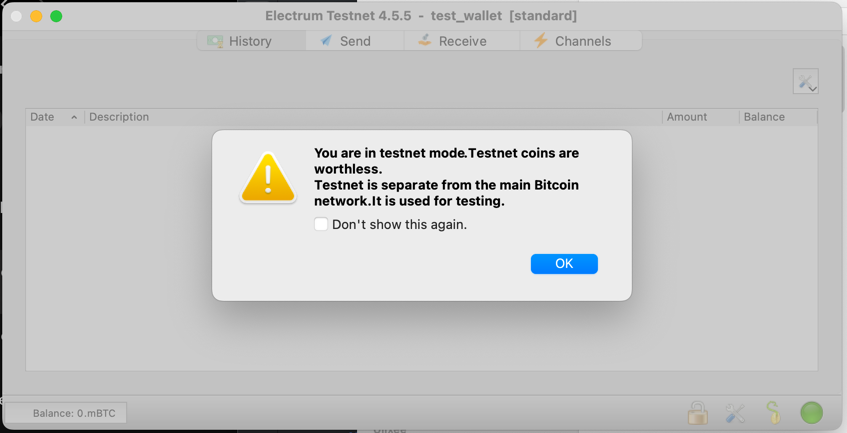

Now go to addresses and copy the address you want to get funds from the Signet faucet:
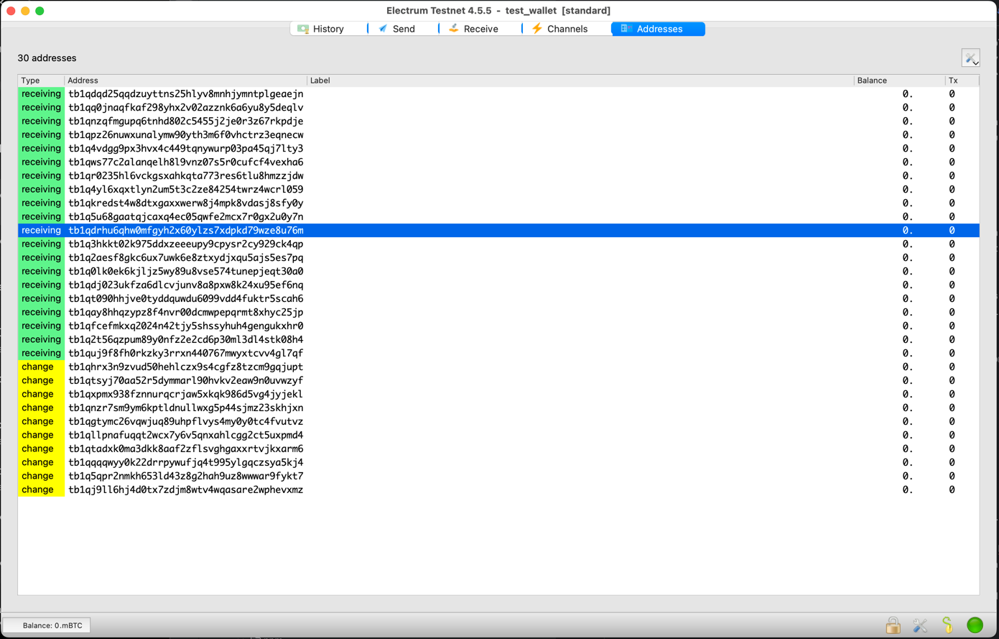

#### Get Faucet BTC

The Argon testnet is a place to experiment with the Argon Network. It is connected to a custom Bitcoin Signet. You will
likely need to acquire testnet Argons and Bitcoins to experiment with this feature.

- [Argon Testnet Faucet](./account-setup.md#requesting-testnet-funds)
- The Testnet Faucet will also grant you Signet Bitcoins (good only on the Argon Testnet). To use it, go to
  our [Discord](https://discord.gg/6JxjCNvu6x) `testnet` channel and type `/drip-bitcoin`. Enter your address at the
  prompt:
  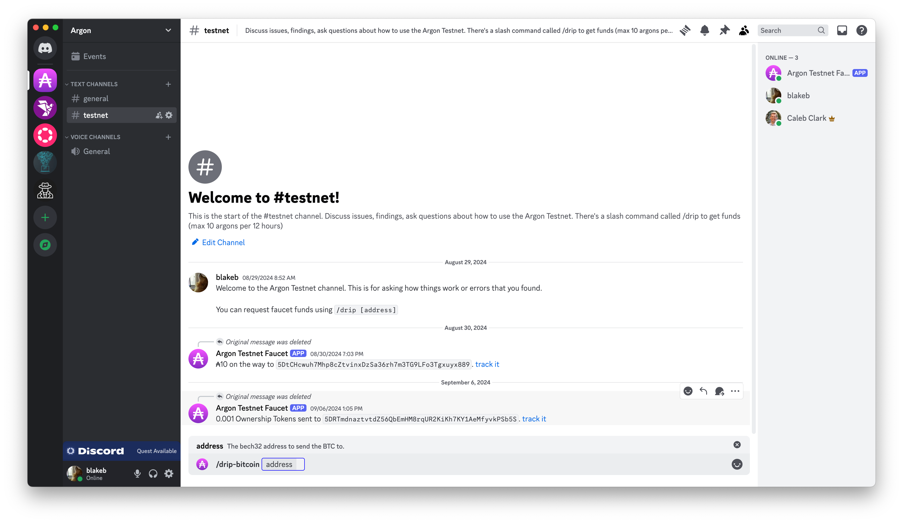

### Insecure Flow Note

We'll be adding support for Hardware wallets and additional software wallets in future releases. It's a goal of this
project for self-custody of Bitcoins to be supported with a wide range of tools, however, miniscript support is
currently limited. For now, we'll show you how to use Electrum for most commands (simply to bypass synching the entire
Bitcoin blockchain - ie, Bitcoin Core QT), and we'll sign the psbt using the Argon CLI.

### Bitcoin Locking Command Line

Argon has a command line interface to simplify the process of locking a Bitcoin. You can find the latest release
on the [releases page](https://github.com/argonprotocol/mainchain/releases/latest).

```bash
$ argon-bitcoin-cli --help
A cli used to manage Stabilization Vaults and Liquid Lock Bitcoins

Usage: argon-bitcoin-cli [OPTIONS] <COMMAND>

Commands:
  vault  List, create and manage vaults
  llb    Lock, unlock and monitor bitcoins
  xpriv  Create, secure, and manage your Bitcoin Master XPriv Key
  utils  Utilities for working with Bitcoin and Argon primitives
  help   Print this message or the help of the given subcommand(s)

Options:
  -t, --trusted-rpc-url <TRUSTED_RPC_URL>  The argon rpc url to connect to [env: TRUSTED_RPC_URL=] [default: ws://127.0.0.1:9944]
  -h, --help                               Print help
  -V, --version                            Print version
```

The `utils` commands are particularly useful for working with Polkadot.js for converting complex numbers.

### 0. Set up your Network

You can set an environment variable to control your network. Pick a trusted RPC url to connect to from the Argon
Network. You can replace the urls in the examples or set the environment variable below.

NOTE: the images in this document show using the Testnet, but the same general scheme applies to the Mainnet
with the appropriate URLs.

*Argon Foundation Mainnet*

```bash
$ export TRUSTED_MAINCHAIN_URL=wss://rpc.argon.network
```

*Testnet*

```bash
$ export TRUSTED_MAINCHAIN_URL=wss://rpc.testnet.argonprotocol.org
```

### 1. Choose a Vault

Every Vault sets terms on a fee (base fee + apr per satoshi) and the amount of collateral they're willing to put up (
securitization) to repay a Bitcoin holder in the cause of fraud. The Bitcoin holder chooses a Vault with terms they like
that has enough argons available to support the amount of Bitcoin they wish to lock up.

#### Using the Polkadot.js interface:

You can view the Vaults and their terms using the Polkadot.js interface


#### Using the CLI:

You can view the Vaults and their terms using the `vaults` command. The convenient function here is it will
also show you how much the fee will be for the amount of Bitcoin you wish to lock up (and which vaults can support
that).

```bash
$ argon-bitcoin-cli vault list --btc=0.00005

Showing for: 5e-5 btc
Current mint value: ₳2.79 argons
╭────┬──────────────────┬───────────────┬────────────────┬────────────╮
│ Id ┆ Bitcoin Space    ┆ Available BAs ┆ Securitization ┆ Lock Fee   │
╞════╪══════════════════╪═══════════════╪════════════════╪════════════╡
│ 1  ┆ \$97.09           ┆ ₳2.90         ┆ 100%           ┆ ₳0.51      │
╰────┴──────────────────┴───────────────┴────────────────┴────────────╯
```

#### Fee Calculation

The fee is calculated as `Base Fee` + `Annual Percent Rate` * `Market rate of Satoshis in Argons`. The parameters can be
found in the Vault Storage and Price Index Storage (plug-in your `satoshis` and `chosen vault`):

- *Bitcoin USD Price:* _Storage:_ `PriceIndex -> current -> btcUsdPrice`
- *Argon USD Price:* _Storage:_ `PriceIndex -> current -> argonUsdPrice`
- *Market Rate of Satoshis in Argons:* `[satoshis] * bitcoinUsdPrice / 100_000_000 / argonUsdPrice`
- *Base Fee:* _Storage:_ `[Chosen Vault] -> bitcoinArgons -> baseFee`
- *Annual Percent Rate:* _Storage:_ `[Chosen Vault] -> bitcoinArgons -> apr`

### 2. Submit a lock request

You need to set-up an account on the [Argon Network](./account-setup.md) to submit a `LLB.requestLock`. Based
on the Vault terms, you will need enough `balance` (eg, _Storage_: `System -> Account -> data -> free`) in your account
to cover the Vault Fee as well as the Fee to submit the transaction to the network.

You'll need to fill in your Satoshis, the Vault ID and you need to tell the Vault what Pubkey you'll
send the funds to (eg, select the address of the next pubkey from Electrum).

> To Extract from Electrum, double-click the next Address. You will copy the public key.
> 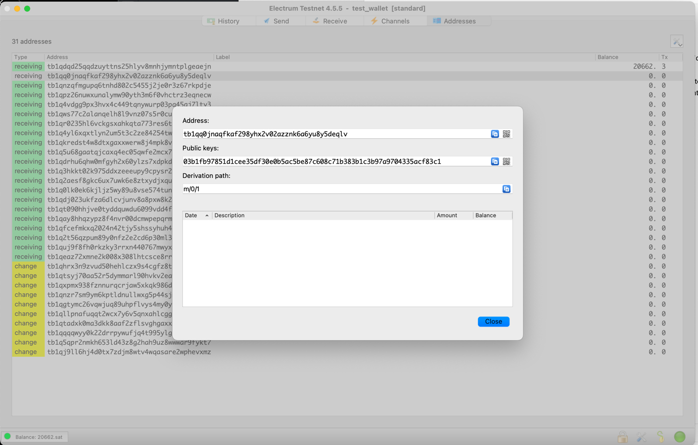

#### Using the Polkadot.js interface:

> Replace your wss:// url below as appropriate for your network

Submit
a [lock request](https://polkadot.js.org/apps/?rpc=wss%3A%2F%2Frpc.testnet.argonprotocol.org#/extrinsics/decode/0x080001000000214e000000000000000000000000000000000000000000000000000000000000000000)
to the mainchain.

NOTE: you'll need to prefix it with 0x to paste into the UI.

#### Using the CLI:

```bash
$ argon-bitcoin-cli llb request-lock --btc=0.00005 --vault-id=1 --owner-pubkey=03b1fb97851d1cee35df30e0b5ac5be87c608c71b383b1c3b97a9704335acf83c1
```

This will generate a link to complete the transaction on the Polkadot.js interface along with the fee that needs to be
available in your account.

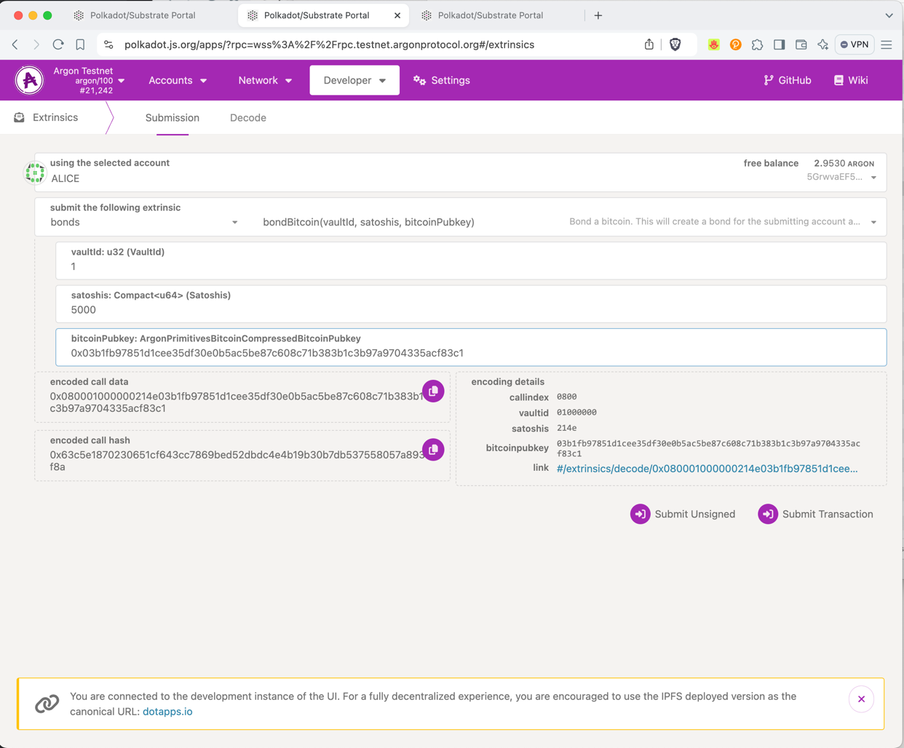

### 3. Wait for your Lock Id

Once you've submitted your lock application, you'll need to wait for your lock to be accepted (a green checkmark will
appear on Polkadot.js).

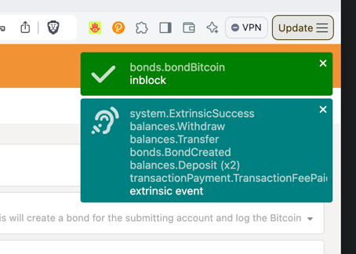

Now head to the block Explorer and find your lock in the most recent Block. You can find the `lockId` in the event:

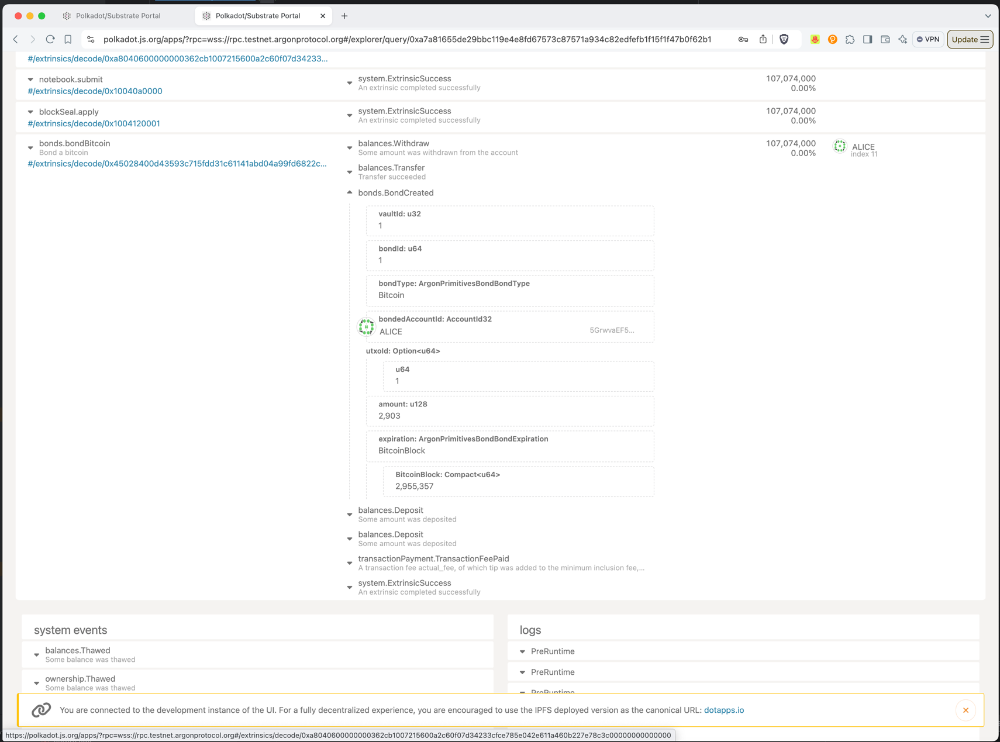

### 4. Send funds to the Bitcoin UTXO

The information in the lock event will tell you the details needed to recreate the UTXO you need to send your Bitcoin
to. The easiest way to generate the UTXO address is to use the bitcoin CLI command (replace your lockId):

NOTE: The resulting utxo must have the same amount of Satoshis as you specify in the command. Ensure your fees are set
to add on top of the amount you specify.

```bash
$ argon-bitcoin-cli llb send-to-address --lock-id=1 -t=wss://rpc.testnet.argonprotocol.org
```

This will output a Pay to Address that you need to send the EXACT funds into. You can use Electrum (or whichever tool
holds your BTC) to send the funds to the MultiSig address.
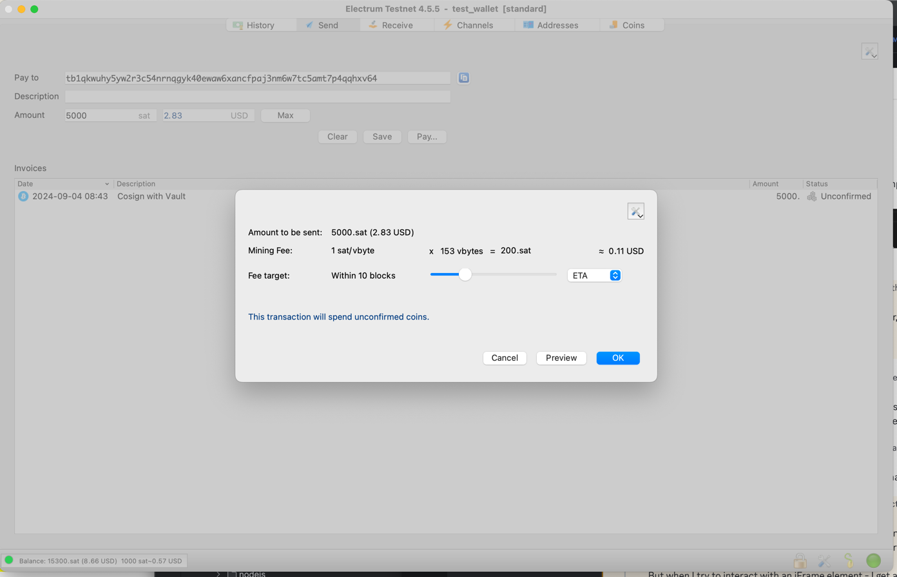

> IMPORTANT: The resulting utxo must have the same amount of Satoshis as you requested to lock. Ensure your fees
> are set to add on top of the amount you specify.

### 5. Wait for Argon Verification

Argon will sync your UTXO once it has 6 confirmations. You can use the CLI to check the verification status of your
lock:

```bash
$ argon-bitcoin-cli llb lock-status --lock-id=1 -t=wss://rpc.testnet.argonprotocol.org
```

You can also use Polkadot.js to verify your Bitcoin UTXO by looking at the
_Storage_: `BitcoinUtxos -> utxosPendingConfirmation()`.
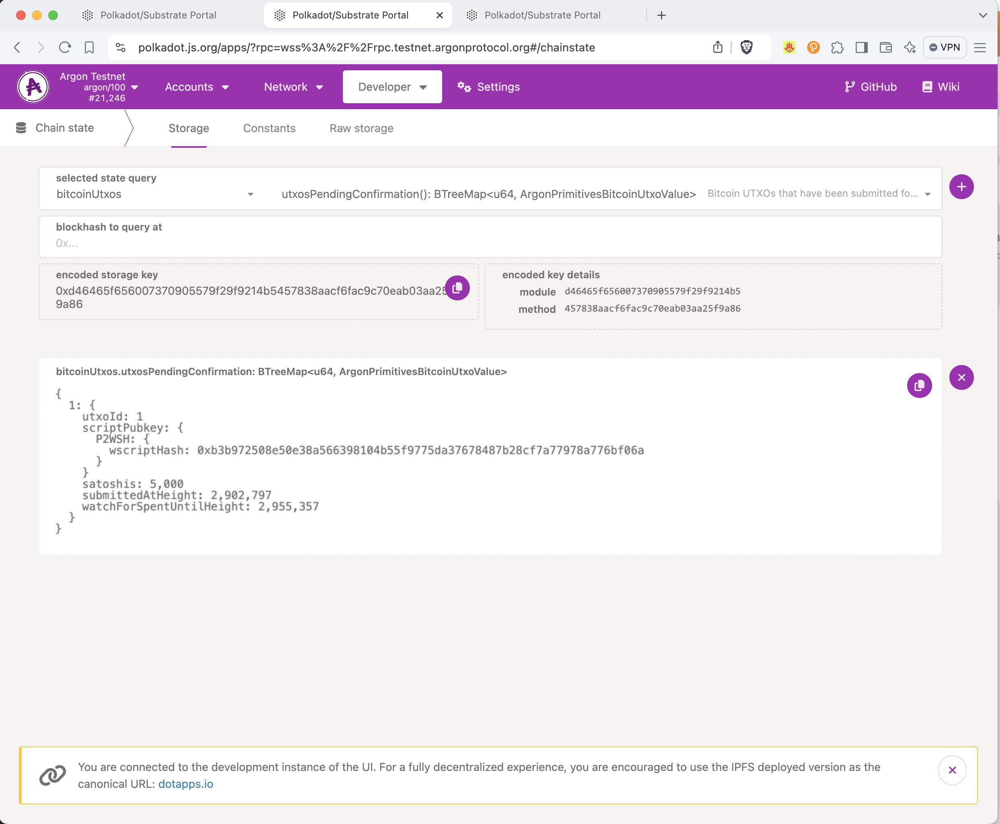

### 6. Monitoring for Minting

You can monitor your Bitcoin Lock status using the `llb lock-status` cli command.

```bash
$ argon-bitcoin-cli llb lock-status --lock-id=1 -t=wss://rpc.testnet.argonprotocol.org
```

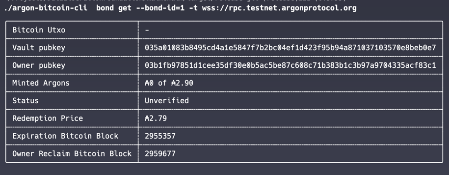

You can also use the Polkadot.js interface to look at the MintQueue (_Storage_: `Mint -> pendingMintUtxos`). The result
is a list of UTXOs that are waiting to be minted (`LockId`, `AccountId`, `Amount Remaining`). Find the entry with your
LockId in as the first parameter.

## Unlocking your Bitcoin

To unlock your Bitcoin, you'll need to have enough Argons in your account to cover the unlock fee. You can see the
"redemption price" using the `llb lock-status` command.

```bash
$ argon-bitcoin-cli llb lock-status --lock-id=1 -t wss://rpc.testnet.argonprotocol.org
```

### 1. Submit an unlock request

The first step is to submit an unlock request to the mainchain. Your unlock request requires the `LockId`, an address
you'd like to send the Bitcoin to, and the `Network Fee` you are willing to pay to unlock the Bitcoin.

NOTE: the network fee will normally change from when you submit the request to when it is processed. However, in the
custom Signet, fees will be stable. The Vault will co-sign the transaction so that you can add additional inputs to
cover the fee. You can see recent fees sent over the public signet using https://mempool.space/signet. The
CLI `fee-rate-sats-per-kb` is in satoshis per byte.

You'll want to get a destination address from Electrum, and see what the current Fee Rate is on the network.
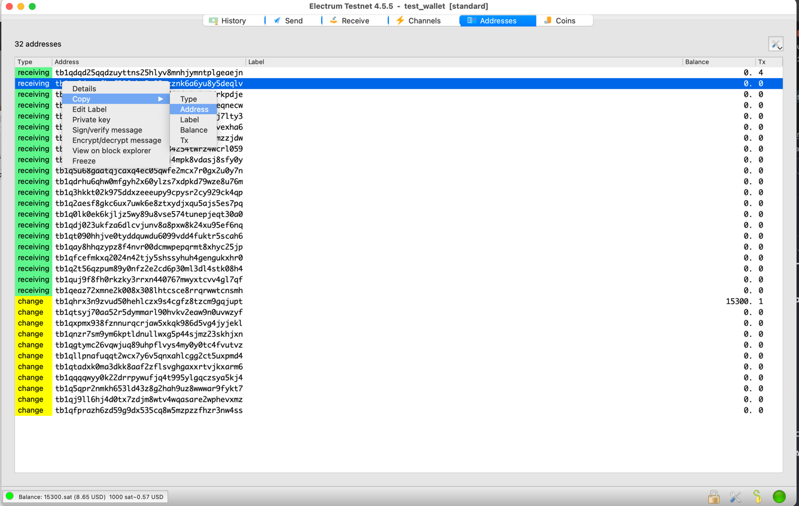
The CLI can help you calculate the network fee:

```bash
$ argon-bitcoin-cli llb request-unlock --lock-id=1 --dest-pubkey=tb1qq0jnaqfkaf298yhx2v02azznk6a6yu8y5deqlv --fee-rate-sats-per-kb=1 -t=wss://rpc.testnet.argonprotocol.org
```

This will provide a link to complete the transaction on the Polkadot.js interface.

### 2. Wait for the Vault to Unlock

Once you've submitted your unlock request, you'll need to wait for the Vault to unlock your Bitcoin. You can monitor the
Polkadot.js interface for the Vault to sign the transaction, or you can pre-sign the transaction and use the "wait"
parameter on the CLI to wait for the transaction to be included in a block.

> TEMPORARY HACK!: Electrum doesn't support miniscript yet, so can't understand the PSBT. You can use the Argon CLI to
> sign the PSBT instead. See below to copy out the private key and sign the PSBT.
>
> 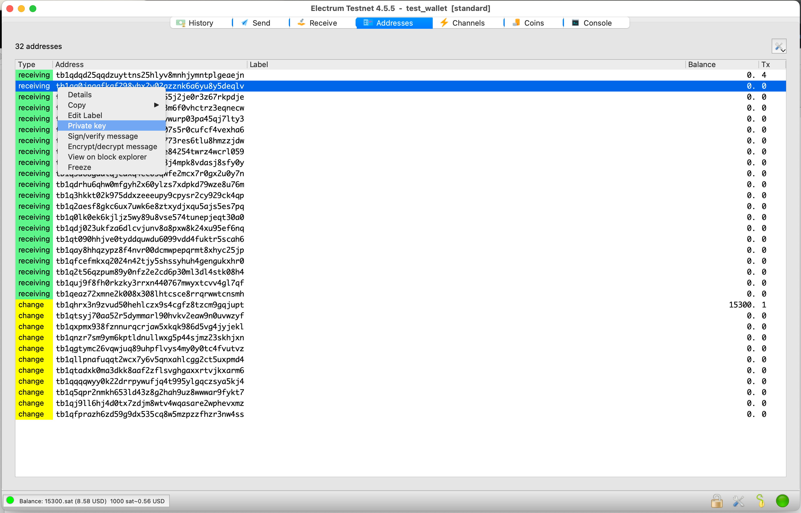

```bash
$ argon-bitcoin-cli llb owner-cosign-psbt --lock-id=1 --private-key=p2wpkh:cMbSXe9bkx3e8xD474wBepzRvqTsNkMMU6sZveLqeENBfPAtWpCw --wait -t=wss://rpc.testnet.argonprotocol.org
```

This command will sit for a while waiting for the transaction to be included in a block. When it completes, you will see
a psbt output that you can import into Electrum.


You'll want to double-check it and then broadcast the transaction (it should be fully signed now)
