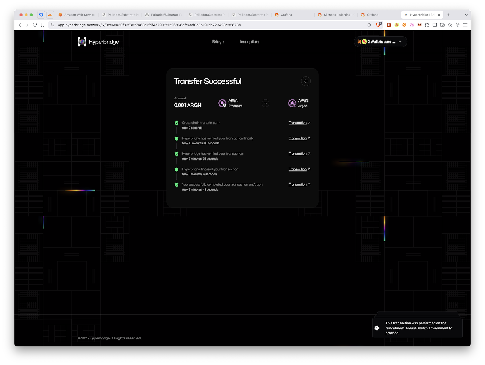

This document describes the options to move Argon tokens across chains.

## Mainchain <-> Localchain

Each account in Argon exists as both a Mainchain and a Localchain account (even if you haven't
transacted on one side yet). Argon allows native transfers between the Mainchain and each account's
corresponding Localchain.

Instructions to perform these steps can be found [here](./localchain.md#creating-a-localchain).

## Argon <-> Ethereum

Argon supports bridging to Ethereum using [Hyperbridge](https://hyperbridge.network), a
trust-minimized solution leveraging Substrate’s deterministic finality. Hyperbridge operates solely
based on cryptographic proofs that a transaction is in a finalized block, which makes it
significantly less risky than traditional bridges that rely on multisig or custodial setups.

NOTE: Hyperbridge is a separate project from Argon, and we have no affiliation with the project
beyond integration activities. However, we know the development team and have confidence in their
work.

### Fees

Independent relayers validate and relay merkle proofs when transferring transactions between Argon
and Ethereum. They're paid in the source token (Argons when bridging to Ethereum, and ETH when
bridging back).

## Argon <-> EVM Chains

Hyperbridge has capabilities to bridge Argon to many other chains, including Polygon, Base,
Arbitrum, Optimism, and more. We plan to onboard these over time, or as requested by the community.

### The Hyperbridge UI

Hyperbridge produces a UI tool allowing you to transfer tokens between Argon and Ethereum. It can be
found [here](https://app.hyperbridge.network). The app provides a straightforward interface to
initiate, track, and rollback cross-chain transfers, integrating seamlessly with popular wallet
extensions.

NOTE: This tool is also produced by Hyperbridge, and we do not control or manage any of the code or
infrastructure.

After you transact, the app will show you the progress of your transaction with links to each chain.
In general, transactions take 5-10 minutes to transfer to Ethereum, and 20-30 minutes to transfer
back to Argon. If your transaction is unsuccessful, you'll have a button to initiate a rollback.

### Ethereum Addresses

The ERC20 token contracts for Argon and Argonots are deployed on Ethereum at the following
addresses:

- Argon:[ `0x6A9143639D8b70D50b031fFaD55d4CC65EA55155`](https://etherscan.io/token/0x6A9143639D8b70D50b031fFaD55d4CC65EA55155)
- Argonots:
  [ `0x64cbd3aa07d427e385cb55330406508718e55f01`](https://etherscan.io/token/0x64cbd3aa07d427e385cb55330406508718e55f01)

You can use a tool like Etherscan to view your ERC20 token balances after the transaction.

### Bridge Safety

Bridges historically carry significant security risks. While Hyperbridge appears well-designed—using
cryptographic proofs and minimizing trust—always exercise caution and perform independent
evaluations before transferring significant amounts.

### Technical Details of an Argon -> Eth Transaction

Hyperbridge UI is actually submitting regular extrinsics to the Argon chain. You can submit your own
transaction using the`tokenGateway->teleport` extrinsic via Polkadot.js.

> **WARNING:** this process carries a bit of risk. If you manually submit via
> `tokenGateway->teleport` and the transaction fails or times out, you will be unable to rollback
> without the UI.

Your transaction will look like:

- _assetId:_ 0 for `Argon`, 1 for `Argonots`
- _destination:_ EVM -> 1 is Ethereum mainnet.
- _recipient:_ The Ethereum address you want to send the funds to, prefixed with 0s until it's 32
  bytes.
- _amount:_ The amount of Argons you want to send, in the smallest unit (1 Argon = 1,000,000
  microgons).
- _timeout:_ 0 - keep this at 0 since you CANNOT rollback without the ux tool.
- _tokenGateway:_ This is the hex address corresponding to deployed TokenGateway script on the
  destination chain. A list can be found here.
  https://docs.hyperbridge.network/developers/evm/contracts/mainnet
- _relayerFee:_ 0 Or the fee you want to pay the relayer. This is in the smallest unit (1 Argon =
  1,000,000 microgons).
- _callData:_ NA
- _redeem_: false

### Technical Details of an Eth -> Argon Transaction

To send a transaction on ethereum, you'll need to use a tool like Etherscan. On Token Gateway, call
[`teleport`](https://etherscan.io/address/0xFd413e3AFe560182C4471F4d143A96d3e259B6dE#writeContract#F8)
with the following parameters:

- _payableAmount:_ 0
- _teleportParams:_
  - _amount:_ Amount with 18 decimals (1 argon is 1e18)
  - _relayerFee:_ 0
  - _assetId:_ keccak256 of the asset symbol (ARGN/ARGNOT)
    - ARGN - 0x430a54a61bf037414def60e0d32b70c7f9194ed8cd6c8d6a11b64ca2aff7ed10
    - ARGNOT - 0x7c58e6fea16e4ac0850b1d2f44e49524b6f8f075de4ea61a93d81dc4ca9ce1fa
  - _redeem:_ false
  - _to:_ 0x(32 byte public key of user) -> Can be found on Polkadotjs -> Developer -> Utilities ->
    Address To Convert -> hex public key
    - eg, 0x507478d8aa5d510c89e0c05b3cf2d37aafad9ca6447e8be1050608bef4242a11
  - _dest:_ 0x5355425354524154452d6172676e (hex encoding of the chain name SUBSTRATE-argn)
  - _timeout:_ 0 for no timeout, else in seconds
  - _nativeCost:_ 0
  - _data:_ 0x
