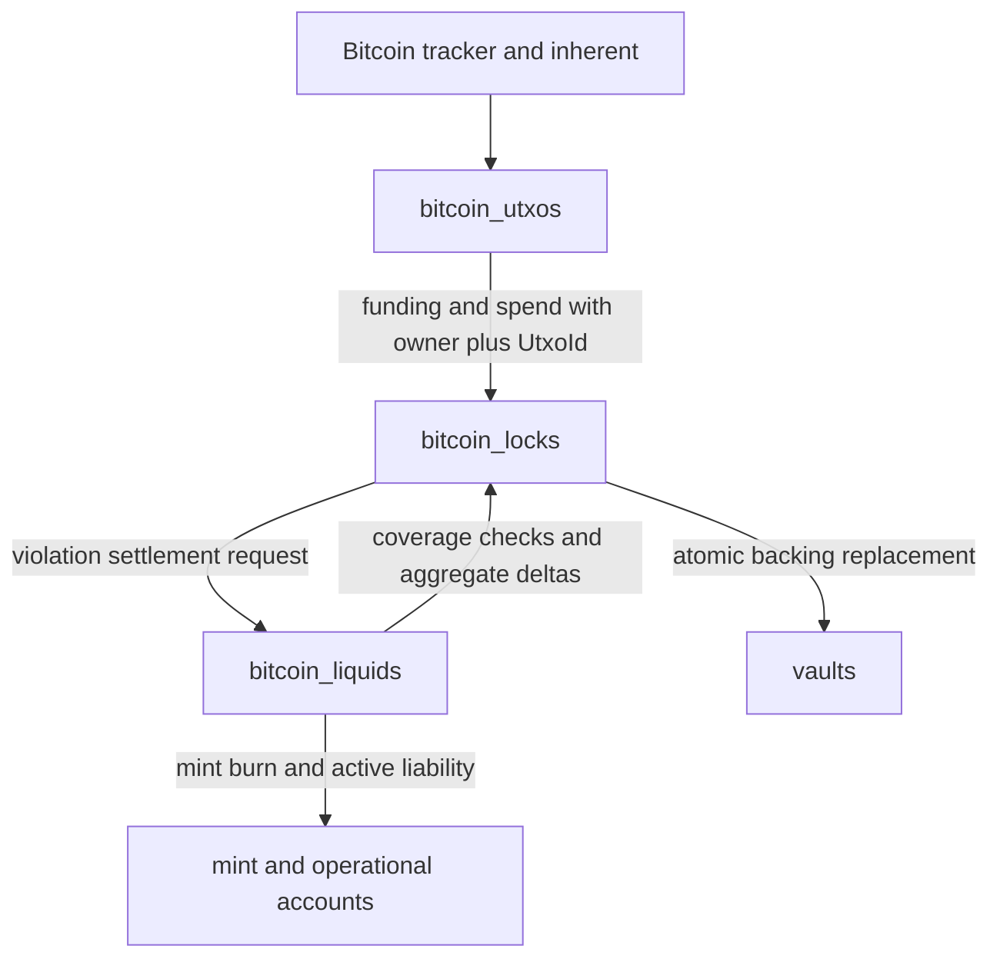
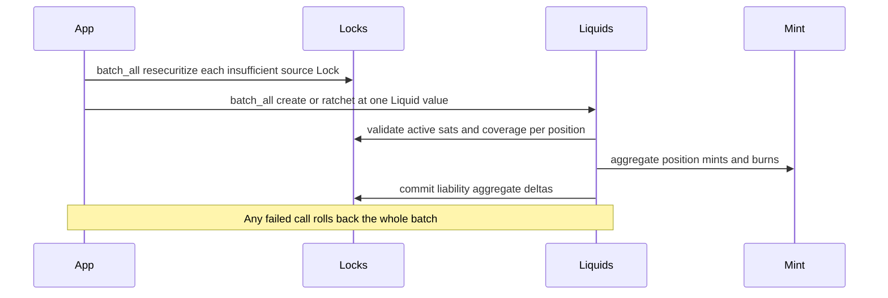
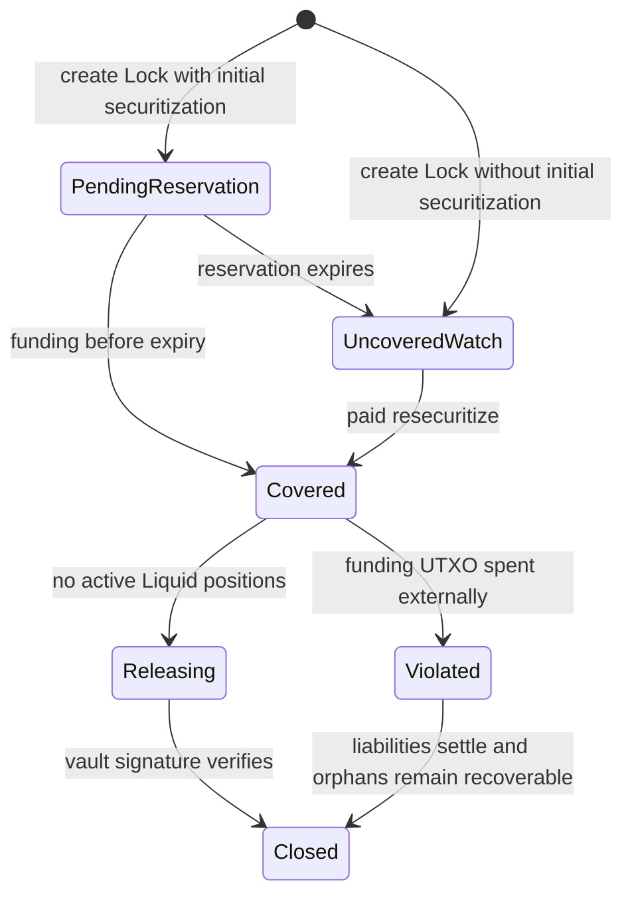

# Bitcoin Lock and Liquid Separation - Plan

## Goal Capsule

- **Objective:** Separate Bitcoin insurance from Liquid accounting while preserving economic
  equilibrium through funding, ratcheting, closing, release, expiry, external Bitcoin spends, and
  migration.
- **Means:** Make owner-scoped Lock identity a protocol-wide foundation, then separate whole-Lock
  securitization from immutable Liquid positions before changing Bitcoin lifecycle behavior
  (KTD1-KTD6).
- **Product authority:** The Product Contract owns behavior. The Planning Contract owns
  implementation mechanics within those requirements.
- **Execution profile:** Deep, migration-sensitive runtime work. Complete U1-U6 in dependency order
  and keep each unit independently reviewable.
- **Stop condition:** Stop rather than guess if implementation would change an R-ID, make
  owner-local IDs ambiguous, or prevent conservation of pre-upgrade liabilities.

---

## Product Contract

### Summary

A Bitcoin Lock has one securitization state covering all of its securitized sats. A Bitcoin Liquid
contains a non-empty, bounded, immutable set of positions backed by one or more owner-held Locks.
Liquid creation is exact and atomic; ratcheting updates positions that meet the per-position
threshold and have sufficient Lock coverage, and leaves the rest unchanged.

### Problem Frame

The current Lock record combines Bitcoin receipt, vault securitization, Liquid liability,
ratcheting, and mint identity. That coupling makes multi-Lock Liquids, partial ratchet eligibility,
and external-spend settlement difficult to express without accounting drift. Candidate and mismatch
handling can be removed while retaining one funding UTXO per Lock.

### Key Decisions

- **Locks and Liquids are separate economic entities.** (session-settled: user-directed — chosen
  over treating securitization and liquidity as one position: securitization insures the Lock while
  Liquid positions own liability.) Governs R1-R11.
- **`UtxoId` and `LiquidId` remain `u64` but are scoped to the owner.** (session-settled:
  user-directed — chosen over global unpredictable IDs and renaming `UtxoId`: callers need
  predictable IDs without broad naming churn.) Governs R12-R14.
- **Each Lock has one securitization value.** (session-settled: user-directed — chosen over
  securitization tranches: adding or changing coverage resecuritizes the whole Lock.) Governs R2-R5.
- **Liquid satoshi composition is immutable.** (session-settled: user-directed — chosen over
  expanding or rebalancing an existing Liquid: additional sats create a new economic position.)
  Governs R6-R8.
- **Liquid positions are embedded in one bounded Liquid record.** (session-settled: user-directed —
  chosen over separate position records: membership is immutable and ratchet examines the positions
  together.) Governs R6-R9.
- **Coverage and liquidity use distinct names.** (session-settled: user-directed — chosen over one
  ambiguous `microgons_per_btc` label: insurance coverage and Liquid value have different roles.)
  Governs R3, R7, R10-R11.
- **Ratchet eligibility belongs to each Liquid position.** (session-settled: user-directed — chosen
  over a rolled-up Liquid threshold: only positions that moved enough may mint or burn.) Governs R9
  and R20.
- **A Lock keeps one funding UTXO in this release.** (session-settled: user-directed — chosen over
  multi-UTXO funding: Liquids may span multiple Locks, while later outputs to a funded Lock remain
  orphans.) Governs R15-R19.

### Requirements

**Lock securitization**

- R1. `LockedBitcoin` remains the durable Bitcoin script, UTXO, timetable, vault, and securitization
  record.
- R2. A Lock stores `securitized_satoshis`, `securitized_microgons_per_btc`, `liquid_satoshis`, and
  `liability_microgons`; the last two fields equal active Liquid-position aggregates for that Lock.
- R3. `securitized_microgons_per_btc` is the per-BTC value insured by the Lock, normalized to
  Argon's target price.
- R4. `resecuritize` replaces the Lock's complete securitization state. Reductions cannot undercut
  active Liquid positions and give no fee refund.
- R5. Initial securitization and positive resecuritization deltas charge the source vault's
  securitization rent fees. Liquid creation and ratcheting charge no separate vault fee.

**Liquid positions**

- R6. A Liquid contains a non-empty bounded list with at most one position per source `UtxoId`;
  every source Lock belongs to the Liquid owner, and its source Locks and satoshi amounts cannot
  change after creation.
- R7. Each position stores `utxo_id`, `satoshis`, `liquid_microgons_per_btc`, `liquidity_promised`,
  its last ratchet number, its last updated Argon block, and an optional settlement Argon block.
- R8. Unallocated or newly securitized sats within a Lock's single funding UTXO require a new Liquid
  rather than expanding an existing Liquid. Later orphan outputs cannot back a Liquid.
- R9. The Liquid header stores its creation Argon block and ratchet number; a successful ratchet
  increments that number once, and only changed positions record it.
- R10. `liquid_microgons_per_btc` is the value realized by a Liquid position, normalized to Argon's
  target price. Current-market values use the explicit name `market_microgons_per_btc`.
- R11. Every active position satisfies `liquid_microgons_per_btc <= securitized_microgons_per_btc`,
  and each Lock satisfies `liquid_satoshis <= securitized_satoshis`.

**Identity and funding**

- R12. `UtxoId` and `LiquidId` remain numeric types but are allocated independently per owner, and
  creation calls include the expected next owner-local ID.
- R13. Existing numeric `UtxoId` values are preserved under their owners during migration; each
  owner's next ID is set above that owner's highest migrated value.
- R14. Liquids are stored by owner and `LiquidId`, so the Liquid record does not duplicate
  `owner_account`; paths without an origin carry the owner separately.
- R15. The first qualifying output to an unfunded Lock script attaches automatically without amount
  matching. Once funded, further same-script outputs enter the existing orphan lifecycle.
  `received_satoshis` records all sats observed at the script rather than only the attached funding
  amount.
- R16. The attached funding UTXO retains its Bitcoin confirmation height; Lock and Liquid creation,
  ratchet, and settlement history use explicitly named Argon block fields.

**Lifecycle**

- R17. New Bitcoin release requests are rejected while any active Liquid position remains allocated
  to the Lock.
- R18. Spending the attached funding UTXO terminates its source Lock, settles actual Liquid
  liabilities from that Lock's securitization, releases excess securitization, and settles only that
  Lock's positions in multi-Lock Liquids. Other positions remain active, and existing orphan outputs
  remain recoverable.
- R19. Candidate and amount-mismatch classification, promotion, and rejection are removed. Existing
  orphan storage, release, expiry, events, and recovery behavior remain supported.
- R20. A position is ratchet-eligible only when the absolute requested change divided by its current
  `liquid_microgons_per_btc` meets the configurable minimum percentage. A ratchet fails if no
  position changes.
- R21. The initial 48-hour securitization reservation may expire without deleting the Lock or script
  watch. The watch remains through the Lock's existing timetable. Expiry clears pending coverage
  without a refund; late funding can attach but requires newly paid securitization before it can
  back a Liquid.
- R22. Closing a Liquid is owner-only and atomic: burn the existing formula-derived redemption
  amount for its active positions, cancel only unpaid Mint entitlement, move no Bitcoin, settle the
  positions, and make their Lock allocations reusable.

### API Surface

```text
bitcoin_locks.create_receive_address(
  utxo_id,
  vault_id,
  bitcoin_pubkey,
  securitization?: {
    securitized_satoshis,
    securitized_microgons_per_btc,
    fee_coupon?
  }
)

bitcoin_locks.resecuritize(
  utxo_id,
  {
    securitized_satoshis,
    securitized_microgons_per_btc,
    fee_coupon?
  }
)

bitcoin_liquids.create(
  liquid_id,
  positions: [{ utxo_id, satoshis }],
  liquid_microgons_per_btc
)

bitcoin_liquids.ratchet(liquid_id, liquid_microgons_per_btc)
bitcoin_liquids.close(liquid_id)
```

Both per-BTC inputs use the existing recent-value rule and are normalized to Argon's target price.
They are not interchangeable: the securitized value is the insurance ceiling, while the Liquid value
determines `liquidity_promised`.

### Key Flows

- F1. **Create Lock:** The owner supplies the next owner-local `UtxoId`; optional initial
  securitization establishes one coverage state for the Lock. Covers R1-R5 and R12.
- F2. **Fund Lock:** The first qualifying same-script output increases cumulative
  `received_satoshis`, records its Bitcoin confirmation height, and becomes the Lock's funding UTXO
  without creating a Liquid. Later outputs increase cumulative receipt but enter the orphan
  lifecycle. Covers R15-R16, R19, and R21.
- F3. **Create Liquid:** The owner supplies the next owner-local `LiquidId` and exact positions;
  creation fails atomically if any Lock's funding UTXO lacks enough unallocated sats or adequate
  securitization. Covers R6-R8, R10-R12, and R14.
- F4. **Up-ratchet:** Each position independently passes R20. Positions whose Locks cover the
  requested Liquid value ratchet fully; threshold-ineligible or undercovered positions remain
  unchanged. A caller may first resecuritize insufficient Locks, optionally in the same atomic
  batch. Covers R4, R7, R9-R11, and R20.
- F5. **Down-ratchet:** Eligible positions ratchet down directly and leave their Locks
  over-securitized. Optional later resecuritization may reduce the excess without a refund. Covers
  R4, R7, R9-R11, and R20.
- F6. **Close or violate:** Closing performs R22 without moving Bitcoin. An external spend of the
  funding UTXO settles actual liabilities from the violated Lock's securitization, terminates the
  Lock, preserves its orphan recovery records, and leaves other Liquid positions active. Covers
  R17-R19 and R22.
- F7. **Reservation expiry and late funding:** Reservation expiry clears pending securitization
  while preserving the address watch. Late sats attach normally but cannot support a Liquid until
  the owner resecuritizes the Lock. Covers R5, R15, and R21.

### Scope Boundaries

- Keep `UtxoId` and `utxo_id`; this release changes allocation and lookup scope but does not rename
  them to Lock IDs.
- Keep the existing orphan lifecycle; automatic same-script attachment removes the
  candidate/mismatch decision process, not orphan recovery.
- Defer attaching multiple funding UTXOs to one Lock and multi-input Lock release. A Liquid may
  still contain positions from multiple Locks.
- While a Lock remains active, do not add fee refunds, high-water marks, automatic
  excess-securitization release, or incentives to reduce excess securitization. Lock termination
  under R18 still releases unused coverage.
- Do not allow Liquid positions to add sats, add Locks, or rebalance sats after creation.
- Preserve existing claim heights and economic formulas unless a requirement explicitly changes
  their ownership or input names.

### Acceptance Examples

- AE1. A Liquid created from two adequately securitized Locks succeeds atomically and records two
  immutable positions at the submitted `liquid_microgons_per_btc`. Covers R6-R11.
- AE2. If only one source Lock is resecured high enough, an up-ratchet updates that eligible
  position and leaves the other unchanged under the same Liquid. Covers R7, R9-R11, and R20.
- AE3. A down-ratchet updates eligible Liquid positions without reducing Lock securitization, and
  later resecuritization may lower coverage only while every active position remains covered. Covers
  R4, R7-R11, and R20.
- AE4. Two owners can use the same numeric `UtxoId` and `LiquidId`; each can determine the next IDs
  before signing, and historical calls contain them. Covers R12-R14.
- AE5. A funding UTXO contains more sats than an existing Liquid uses; after whole-Lock
  resecuritization, the owner can create another Liquid from the unallocated sats without changing
  the first Liquid. Covers R4, R8, and R15.
- AE6. A second same-script output received after the Lock is funded is recorded as an orphan
  without candidate or mismatch approval. Covers R15 and R19.
- AE7. Spending the funding UTXO settles only that Lock's actual liabilities, releases unused
  securitization, preserves unrelated positions in a multi-Lock Liquid, and retains existing orphan
  recovery. Covers R18-R19.
- AE8. A reservation expires, its late output attaches, and Liquid creation remains blocked until a
  newly paid resecuritization covers it. Covers R5 and R21.

---

## Planning Contract

**Product Contract preservation:** restructured, no scope change. R7 carries position settlement
history, R9 carries Liquid ratchet history, and R20-R21 separate the already-settled
ratchet-threshold and reservation-expiry rules.

### Key Technical Decisions

- KTD1. **Use owner plus local ID as the internal identity.** (session-settled: user-directed —
  chosen over global IDs or a second public composite ID: callers retain simple numeric IDs while
  internal paths remain unambiguous.) Store Locks and Liquids under owner-keyed maps and carry owner
  with `UtxoId` through inherents, runtime APIs, tracking, schedules, callbacks, mint records, and
  vault cosign paths. Activate owner-local allocation only after block producers emit the
  owner-bearing observation version; accept the prior variant during transition only when its bare
  ID resolves uniquely. Governs R12-R14.
- KTD2. **Validate expected IDs before incrementing per-owner counters.** Compare the submitted ID
  to the stored next ID, reject stale or skipped values, then use checked increment. This follows
  the per-account nonce pattern without the current saturating global allocator. Governs R12-R13.
- KTD3. **Replace Lock backing through one Vault provider operation.** Compute old and new
  whole-Lock insured microgons, apply the net collateral and satoshi delta atomically, and charge
  rent only for positive coverage. Do not compose `lock`, `cancel`, and `schedule_for_release` into
  observable intermediate states. Governs R2-R5, R11, and R21.
- KTD4. **Make `bitcoin_liquids` the sole owner of Liquid economics.** Store one bounded Liquid
  under owner and local ID, retain settled positions with `settled_at_argon_block`, and maintain a
  bounded active Lock-to-Liquid reverse index. Lock `liquid_satoshis` and `liability_microgons` are
  transactional derived aggregates; settled positions remain historical but leave active indexes and
  totals. (session-settled: user-approved — chosen over physically removing violated positions:
  immutable composition and historical position data remain available.) Governs R6-R11, R14, and
  R18.
- KTD5. **Move mint and account progress to Liquid economic events.** Queue entries carry owner,
  `LiquidId`, and source `UtxoId`; FIFO indices and cursors remain unchanged. Lock
  over-securitization never changes mint or operational-account totals. Governs R5-R11, R14, and
  R18.
- KTD6. **Keep release single-input and freeze its terms.** A release request fixes the one attached
  funding UTXO, destination, and fee; then it rejects Liquid or resecuritization mutations and sends
  later same-script outputs to the orphan lifecycle. The vault signature binds to that transaction,
  and finalization occurs only after it verifies. Governs R15-R19.
- KTD7. **Run one dependency-ordered runtime migration.** Correct legacy ratchet state first, derive
  the legacy ID-to-owner map, migrate authoritative Lock/Liquid economics, then migrate UTXOs, Mint,
  derived account totals, indexes, and counters. Governs R2, R7-R19.
- KTD8. **Use an explicit legacy history baseline.** Seed migrated `received_satoshis` from retained
  funding, candidate, and orphan records because deleted historical observations are unrecoverable.
  Migrated positions use ratchet number zero and the upgrade block as their last-updated baseline;
  accounting is exact from that point forward. Governs R7, R9, R13, and R15-R16.
- KTD9. **Keep cross-pallet calls cycle-free.** Put narrow Lock coverage/aggregate and Liquid
  settlement provider traits in `primitives`; the runtime wires implementations, and `bitcoin_utxos`
  reports observations without owning economic settlement. Governs R1-R2 and R18.
- KTD10. **Plan then commit each ratchet transactionally.** Determine the eligible, sufficiently
  covered change set without writes; fail if it is empty; prevalidate all bounds and downstream
  accounting; then update positions, Lock aggregates, Mint, and operational totals in one storage
  transaction. `utility.batch_all` makes preceding resecuritizations and the ratchet one atomic app
  operation. Governs R9-R11 and R20.
- KTD11. **Preserve each terminal path's existing economics.** Liquid close uses R22; claim-height
  expiry and external-spend violation call Liquid settlement with their existing distinct Mint and
  collateral treatment. A release already pending at migration remains active but frozen until
  completion, overdue handling, or expiry settles it exactly once. Governs R17-R19 and R22.

### High-Level Technical Design







| API owner         | Mutates                                                    | Does not mutate                |
| ----------------- | ---------------------------------------------------------- | ------------------------------ |
| `bitcoin_locks`   | Lock identity, funding UTXO, securitization, release state | Liquid rates or mint liability |
| `bitcoin_liquids` | Position rates, liability, mint/burn state                 | Vault fees or Lock coverage    |
| `bitcoin_utxos`   | Bitcoin observations and attached-output tracking          | Product economics              |
| `vaults`          | Collateral, securitized sats, rent, release schedules      | Liquid composition             |

### Sequencing

U1 makes owner-local identities safe across the protocol. U2 separates Lock coverage. U3 moves
Liquid economics and minting. U4 changes funding, release, and violation behavior only after those
boundaries exist. U5 migrates all authoritative and derived state in that order. U6 removes old
surfaces and completes runtime/client cutover.

### System-Wide Impact

- **Node/runtime protocol:** Bitcoin inherent and runtime API payloads gain owner identity.
- **Accounting:** Liquid positions are authoritative; Lock aggregates, Mint, and operational totals
  follow active Liquid liability, while Vault backing follows Lock coverage.
- **Pallet boundaries:** Lock and Liquid provider traits live in `primitives`; runtime wiring
  prevents either pallet from importing the other.
- **Storage cardinality:** Positions per Liquid and Liquids per Lock become explicit benchmark
  dimensions; one attached UTXO per Lock remains unchanged.
- **Clients:** Extrinsics, events, storage keys, metadata, and handwritten Bitcoin helpers change
  together.

### Risks and Dependencies

- A bare `UtxoId` left in a timer, reverse index, or callback can cross owners once numeric IDs
  collide.
- Enabling owner-local allocation before block producers emit owner-bearing observations can make a
  bare-ID inherent ambiguous; KTD1 makes activation ordering a release gate.
- Independent pallet migrations can lose the legacy owner needed to rewrite UTXO and Mint keys.
- The release signature must bind the funding input, destination, and fee or authorization becomes
  ambiguous.
- `received_satoshis` cannot be historically exact for observations already deleted before
  migration; KTD8 makes the boundary explicit.
- Runtime upgrade rollback is forward-only after new storage versions finalize; preflight
  cardinality, migration weight, and pre/post invariants must pass on both networks before
  activation.

---

## Implementation Units

### U1. Make owner-local Lock identity protocol-wide

- **Goal:** Make duplicate numeric Lock IDs safe and establish the shared `LiquidId` type before new
  economic behavior depends on them.
- **Requirements:** R12-R13, R16; F1; AE4; KTD1-KTD2.
- **Dependencies:** None.
- **Files:** `primitives/src/bitcoin.rs`, `primitives/src/inherents.rs`,
  `primitives/src/providers.rs`, `primitives/src/apis.rs`, `runtime/common/src/apis.rs`,
  `bitcoin/src/utxo_spend_filter.rs`, `node/bitcoin_utxo_tracker/src/lib.rs`,
  `pallets/bitcoin_locks/src/lib.rs`, `pallets/bitcoin_locks/src/tests.rs`.
- **Approach:** Add the shared `LiquidId` type, owner-key Lock storage, and per-owner next-Lock-ID
  storage. Carry owner plus local `UtxoId` through the versioned inherent, runtime API, node
  tracker, schedules, callbacks, and vault indexes without exposing a second public ID type. U3 owns
  Liquid storage and its per-owner counter.
- **Patterns to follow:** `NextTransferOutNonceBySendingAccountId` in
  `pallets/crosschain_transfer/src/lib.rs`; the existing V1/V2 Bitcoin inherent compatibility
  conversion in `primitives/src/inherents.rs`.
- **Test scenarios:**
  1. Covers AE4 for Locks. Two owners create, fund, spend, and release Locks with the same numeric
     `UtxoId` without cross-reading state or events.
  2. A create call with the exact next owner-local ID succeeds and advances only that owner's
     counter.
  3. A stale, skipped, or overflowed submitted ID fails without creating storage or advancing the
     counter.
  4. The node emits an owner-bearing inherent accepted by the new runtime; the preceding variant
     works only for a uniquely resolvable ID and is rejected after owner-local activation.
- **Verification:** Every Lock-related map, bounded schedule, provider callback, inherent item, and
  node-tracker key resolves owner plus `UtxoId`; no new Lock behavior relies on a bare ID.

### U2. Separate and replace whole-Lock securitization

- **Goal:** Make Lock coverage independently mutable without changing Liquid liability.
- **Requirements:** R1-R5, R11, R21; F1, F4-F5, F7; AE3, AE8; KTD3.
- **Dependencies:** U1.
- **Files:** `pallets/bitcoin_locks/src/lib.rs`, `pallets/bitcoin_locks/src/tests.rs`,
  `pallets/bitcoin_locks/src/benchmarking.rs`, `pallets/bitcoin_locks/src/weights.rs`,
  `primitives/src/vault.rs`, `pallets/vaults/src/lib.rs`, `pallets/vaults/src/tests.rs`,
  `pallets/vaults/src/benchmarking.rs`, `pallets/vaults/src/weights.rs`.
- **Approach:** Replace mixed Lock fields and `increase_securitization` with the Lock coverage
  fields and owner-only `resecuritize`. Extend fee-coupon signing to the owner-local Lock and full
  replacement terms. Add one Vault provider mutation that applies coverage deltas, metrics, pending
  state, flexible backing, holds, and rent atomically.
- **Execution note:** Add characterization coverage for full and fully reserved Vaults before
  replacing the current multi-call accounting path.
- **Patterns to follow:** Vault invariant checks and replacement-capacity behavior in
  `primitives/src/vault.rs`; recent target-value history and coupon nonce checks in
  `pallets/bitcoin_locks/src/lib.rs`.
- **Test scenarios:**
  1. Initial coverage and an upward value or satoshi replacement charge base plus remaining-term
     rent only on the positive insured-microgon delta.
  2. A downward replacement releases excess capacity, gives no refund, and rejects any state below
     active Liquid sats or value.
  3. A sats increase paired with a rate decrease uses the net insured-microgon delta rather than
     satoshi direction.
  4. An unauthorized owner, stale target value, replayed coupon, or insufficient Vault capacity
     rolls back every Lock and Vault mutation.
  5. Covers AE8. Reservation expiry clears pending coverage but retains the Lock; late funding
     remains unusable by a Liquid until resecuritized.
- **Verification:** Lock fields no longer own Liquid price or mint state, and Vault totals, metrics,
  pending state, and operational hooks remain balanced after every success or rollback.

### U3. Add Liquid positions and move the economic lifecycle

- **Goal:** Make `bitcoin_liquids` own immutable positions, per-position ratchets, closure, minting,
  and active-liability aggregates.
- **Requirements:** R6-R11, R14, R18, R20, R22; F3-F6; AE1-AE4, AE7; KTD4-KTD5, KTD9-KTD11.
- **Dependencies:** U1-U2.
- **Files:** `Cargo.toml`, `pallets/bitcoin_liquids/Cargo.toml`,
  `pallets/bitcoin_liquids/src/lib.rs`, `pallets/bitcoin_liquids/src/mock.rs`,
  `pallets/bitcoin_liquids/src/tests.rs`, `pallets/bitcoin_liquids/src/benchmarking.rs`,
  `pallets/bitcoin_liquids/src/weights.rs`, `primitives/src/providers.rs`,
  `pallets/bitcoin_locks/src/lib.rs`, `pallets/mint/src/lib.rs`, `pallets/mint/src/tests.rs`,
  `pallets/mint/src/benchmarking.rs`, `pallets/mint/src/weights.rs`,
  `pallets/operational_accounts/src/lib.rs`, `pallets/operational_accounts/src/tests.rs`,
  `runtime/common/src/benchmarking.rs`.
- **Approach:** Store owner-keyed Liquids with their own per-owner expected-ID counter, embedded
  bounded positions, and a bounded active Lock-to-Liquid reverse index. Move the existing redemption
  and ratchet formulas without changing them. Plan each ratchet read-only, prevalidate its complete
  change set, and commit all effects transactionally through cycle-free provider traits. Replace
  `UtxoLockEvents` with Liquid economic events, preserving Mint FIFO indices while making cleanup
  position-specific.
- **Execution note:** Implement new Liquid behavior test-first around aggregate conservation and
  mixed-position ratchets.
- **Patterns to follow:** Monotonic Mint queue and cursor handling in `pallets/mint/src/lib.rs`;
  provider-weight composition in `pallets/bitcoin_utxos/src/weights.rs`.
- **Test scenarios:**
  1. Covers AE1. Exact multi-Lock creation succeeds only when every position is owner-held,
     unallocated, funded, and covered; any invalid position rolls back the whole call.
  2. Duplicate source Locks, excess sats, release-in-progress Locks, stale rates, and wrong expected
     `LiquidId` fail without changing Lock aggregates or Mint.
  3. Covers AE2. One requested up-ratchet fully updates each position meeting R20 and coverage,
     while threshold-ineligible or undercovered positions remain unchanged.
  4. A down-ratchet burns and requeues the existing formula, leaves Lock coverage unchanged, and
     increments the Liquid ratchet number once.
  5. A ratchet with no eligible and sufficiently covered position fails without writes; any
     downstream bound or accounting failure rolls back the complete change set.
  6. Covers R22. Closing burns the formula-derived redemption, cancels only that Liquid's unpaid
     Mint entries, moves no Bitcoin, and makes its allocations reusable; insufficient funds roll
     back the close.
  7. Two Liquids sharing a Lock cannot remove each other's Mint entries, and operational-account
     Bitcoin totals equal active Liquid liability rather than Lock coverage.
  8. Claim-height expiry settles the expiring Lock's positions through the existing expiry-specific
     Mint and collateral treatment without affecting other positions.
- **Verification:** Liquid position sums equal every Lock's `liquid_satoshis` and
  `liability_microgons`; Mint and operational totals change only through Liquid economic events.

### U4. Remove mismatch candidates while preserving single-UTXO Locks

- **Goal:** Attach one funding UTXO without amount matching, route later outputs directly to
  orphans, and preserve single-input release and violation behavior.
- **Requirements:** R15-R19, R21; F2, F6-F7; AE5-AE8; KTD6, KTD9.
- **Dependencies:** U1-U3.
- **Files:** `primitives/src/bitcoin.rs`, `primitives/src/providers.rs`,
  `pallets/bitcoin_utxos/src/lib.rs`, `pallets/bitcoin_utxos/src/tests.rs`,
  `pallets/bitcoin_utxos/src/benchmarking.rs`, `pallets/bitcoin_utxos/src/weights.rs`,
  `pallets/bitcoin_locks/src/lib.rs`, `pallets/bitcoin_locks/src/tests.rs`,
  `pallets/bitcoin_locks/src/benchmarking.rs`, `bitcoin/src/cosign_releaser.rs`,
  `bitcoin/src/utxo_spend_filter.rs`, `node/bitcoin_utxo_tracker/src/lib.rs`.
- **Approach:** Keep the singular funding ref and make its UTXO facts owner-aware. Remove the
  candidate set and amount-threshold branch: the first qualifying observation funds an unfunded
  Lock, while every later same-script output enters the existing idempotent orphan path. Keep each
  sync item transactional and retain the existing single-input release shape.
- **Patterns to follow:** Per-sync-item storage layers in `pallets/bitcoin_utxos/src/lib.rs`;
  current orphan release lifecycle in `pallets/bitcoin_locks/src/lib.rs`.
- **Test scenarios:**
  1. The first qualifying same-script output funds an unfunded Lock, retains its confirmation
     height, updates cumulative receipt, and does not create a Liquid.
  2. Covers AE6. A later same-script output increases cumulative receipt but becomes an orphan
     without candidate approval or replacing the funding UTXO.
  3. A release request with active positions fails; after closure, it freezes the funding UTXO and
     terms, rejects Lock/Liquid mutations, routes later outputs to orphans, and requires the vault
     signature before mutation.
  4. An invalid, missing, or transaction-mismatched signature leaves the release, Lock, funding
     UTXO, and holds unchanged.
  5. Covers AE7. An external spend of the funding UTXO settles only that Lock's active positions,
     cancels their pending mints, consumes actual liability coverage, releases excess, and preserves
     its orphan records.
  6. Funding and spending the same output in one inherent produces one terminal Lock outcome without
     phantom receipt, liability, or tracker state.
- **Verification:** No new observation enters candidate state, a Lock never has more than one
  attached funding UTXO, and release or violation cannot leave partial Lock, Liquid, Mint, Vault, or
  orphan state.

### U5. Migrate authoritative and derived state in dependency order

- **Goal:** Preserve all live economics and recoverable Bitcoin workflows across the runtime
  upgrade.
- **Requirements:** R2, R7-R19; AE4, AE7; KTD7-KTD8.
- **Dependencies:** U1-U4.
- **Files:** `pallets/bitcoin_locks/src/migrations/mod.rs`,
  `pallets/bitcoin_utxos/src/migrations/mod.rs`, `pallets/bitcoin_liquids/src/migrations/mod.rs`,
  `pallets/mint/src/migrations/mod.rs`, `pallets/operational_accounts/src/migrations/mod.rs`,
  `runtime/common/src/lib.rs`.
- **Approach:** Run the existing legacy-ratchet correction first. Preflight a complete,
  conflict-free owner map and every new bound. Migrate Lock and funding-UTXO keys, copy each Lock's
  exact stored economic basis into its initial owner-scoped Liquid without repricing, retarget Mint
  entries without changing FIFO state, reconcile derived account totals, preserve release/orphan
  workflows, and set per-owner next IDs last. Deduplicate retained observations by `UtxoRef`;
  convert every retained candidate to an orphan rather than attaching another UTXO.
- **Execution note:** Treat try-runtime pre/post assertions as the primary proof before runtime
  activation.
- **Patterns to follow:** `VersionedMigration` and economic pre/post checks in
  `pallets/bitcoin_locks/src/migrations/mod.rs`; explicit dependency ordering in
  `runtime/common/src/lib.rs`.
- **Test scenarios:**
  1. A funded legacy Lock becomes one owner-scoped Lock and one same-number Liquid with its exact
     stored liability, rate basis, rounding, pending Mint remainder, and FIFO position.
  2. An unfunded Lock remains a watched Lock without a Liquid; pending coverage and expiry behavior
     migrate without creating liability.
  3. Pending releases retain an active-but-frozen position, aggregates, held redemption, deadline,
     and cosign state until completion, overdue handling, or expiry settles them exactly once.
  4. Every globally unique legacy ID resolves to exactly one owner and rewrites all indexes and
     schedules under that owner; after migration, different owners may create the same numeric ID,
     and each next ID is that owner's maximum plus one.
  5. Every retained candidate becomes an orphan, and the migrated receipt baseline equals the union
     of distinct funding, candidate, and orphan `UtxoRef`s; replay and later spend do not change it
     twice or decrement it.
  6. Per-owner and per-Lock pre/post values match for coverage, active liability, Vault collateral,
     exact Mint FIFO entry identity/cursors, operational totals, releases, and forward/reverse
     indexes.
- **Verification:** The coordinated migration is registered in `runtime/common/src/lib.rs`;
  preflight proves bound cardinalities and upgrade weight; storage versions advance only after each
  successful transformation; any unresolved reference or invariant mismatch blocks activation. After
  activation, recovery uses a forward repair runtime rather than the old schema.

### U6. Activate both runtimes and cut over clients

- **Goal:** Expose only the new Lock/Liquid surface and verify the complete end-to-end transition.
- **Requirements:** R1-R22; F1-F7; AE1-AE8.
- **Dependencies:** U1-U5.
- **Files:** `Cargo.toml`, `runtime/common/Cargo.toml`, `runtime/common/src/config.rs`,
  `runtime/common/src/call_filters.rs`, `runtime/common/src/lib.rs`, `runtime/argon/Cargo.toml`,
  `runtime/argon/src/lib.rs`, `runtime/argon/src/benchmark.rs`, `runtime/argon/src/weights/mod.rs`,
  `runtime/argon/src/weights/pallet_bitcoin_liquids.rs`, `runtime/canary/Cargo.toml`,
  `runtime/canary/src/lib.rs`, `runtime/canary/src/benchmark.rs`,
  `runtime/canary/src/weights/mod.rs`, `runtime/canary/src/weights/pallet_bitcoin_liquids.rs`,
  `client/src/spec.rs`, `client/nodejs/src/interfaces/lookup.ts`,
  `client/nodejs/src/BitcoinLock.ts`, `client/nodejs/src/__test__/BitcoinLock.test.ts`,
  `end-to-end/src/bitcoin.rs`.
- **Approach:** Assign `bitcoin_liquids` the same unused stable pallet index in Argon and Canary.
  Select Liquid bounds from U3 maximum-weight and live-cardinality evidence; configure R20's
  threshold; include both Bitcoin pallets in Bitcoin proxy batches; advance the runtime spec
  version; regenerate metadata and Node interfaces; and remove Lock ratchet,
  `increase_securitization`, candidate storage/calls/events/errors/weights, and client wrappers
  together. Preserve orphan APIs.
- **Patterns to follow:** Existing runtime pallet index gaps in `runtime/argon/src/lib.rs`;
  generated-client workflow in `client/update.sh`; Bitcoin end-to-end helpers in
  `end-to-end/src/bitcoin.rs`.
- **Test scenarios:**
  1. Argon and Canary expose identical Lock/Liquid calls, constants, storage, events, weights, proxy
     filtering, and migration ordering.
  2. The Node client predicts owner-local IDs, batches resecuritization with create or ratchet
     atomically, and distinguishes securitized, Liquid, and market values.
  3. End-to-end coverage creates a multi-vault Liquid, runs mixed eligibility up/down ratchets,
     closes it, and releases each source Lock through its existing single-input flow.
  4. End-to-end late funding requires resecuritization; a second same-script output and the
     external-spend path preserve orphan recovery without candidate calls.
  5. Generated Rust and TypeScript surfaces contain no removed candidate, Lock-ratchet, or
     `increase_securitization` API while retaining orphan release APIs.
  6. Activation is blocked until every Argon and Canary block producer runs the owner-bearing
     observation build; mixed-version testing proves the previous variant remains safe only while
     IDs are globally unique.
- **Verification:** Both runtimes build with generated weights, clients compile against regenerated
  metadata, and the Bitcoin end-to-end suite exercises every acceptance example.

---

## Verification Contract

| Gate            | Command                                                                                                                                                                      | Proves                                                              |
| --------------- | ---------------------------------------------------------------------------------------------------------------------------------------------------------------------------- | ------------------------------------------------------------------- |
| Formatting      | `cargo make fmt`                                                                                                                                                             | Repository nightly formatting is applied.                           |
| Core behavior   | `cargo test -p pallet-bitcoin-liquids -p pallet-bitcoin-locks -p pallet-bitcoin-utxos -p pallet-mint -p pallet-vaults -p pallet-operational-accounts --features try-runtime` | Lock, Liquid, UTXO, Mint, Vault, account, and migration behavior.   |
| Node protocol   | `cargo test -p argon-primitives -p argon-bitcoin -p argon-bitcoin-utxo-tracker`                                                                                              | Owner-bearing inherent, tracker, and single-input release behavior. |
| Runtime quality | `cargo make lint-check`                                                                                                                                                      | Workspace lint and cross-runtime compilation.                       |
| Metadata        | `cargo make update-metadata`                                                                                                                                                 | Rust and Node client surfaces match the activated runtime.          |
| End to end      | `cargo test -p end-to-end bitcoin -- --nocapture`                                                                                                                            | User-visible Lock/Liquid flows and preserved orphan recovery.       |

All bounded benchmarks must use their maximum relevant dimension: positions per Liquid, Liquids per
Lock, Mint reverse entries, and concurrent expiry or release entries.

---

## Definition of Done

- U1: Two owners can safely reuse numeric Lock IDs through the node, inherent, runtime, storage, and
  event surfaces; the shared Liquid ID type is ready for U3.
- U2: Lock coverage can be replaced up or down atomically, with rent charged only for positive
  securitization and no Liquid mutation.
- U3: Owner-local Liquids own immutable positions, ratchet history, liability, Mint identity,
  formula-preserving closure, expiry, and selective forced settlement.
- U4: Each Lock has one attached funding UTXO; later same-script outputs become orphans, and
  single-input release or external spend settles all affected state atomically.
- U5: Try-runtime proves preservation of pre-upgrade coverage, liabilities, queues, holds, indexes,
  counters, releases, and orphans.
- U6: Argon, Canary, generated clients, Node helpers, and end-to-end flows expose the new APIs and
  no candidate/mismatch or Lock-ratchet surface.
- Every invariant in R11 holds after each transaction, rollback, migration, and runtime restart.
- Abandoned experimental code, obsolete wrappers, removed weights, and dead candidate paths are
  absent from the final diff.
