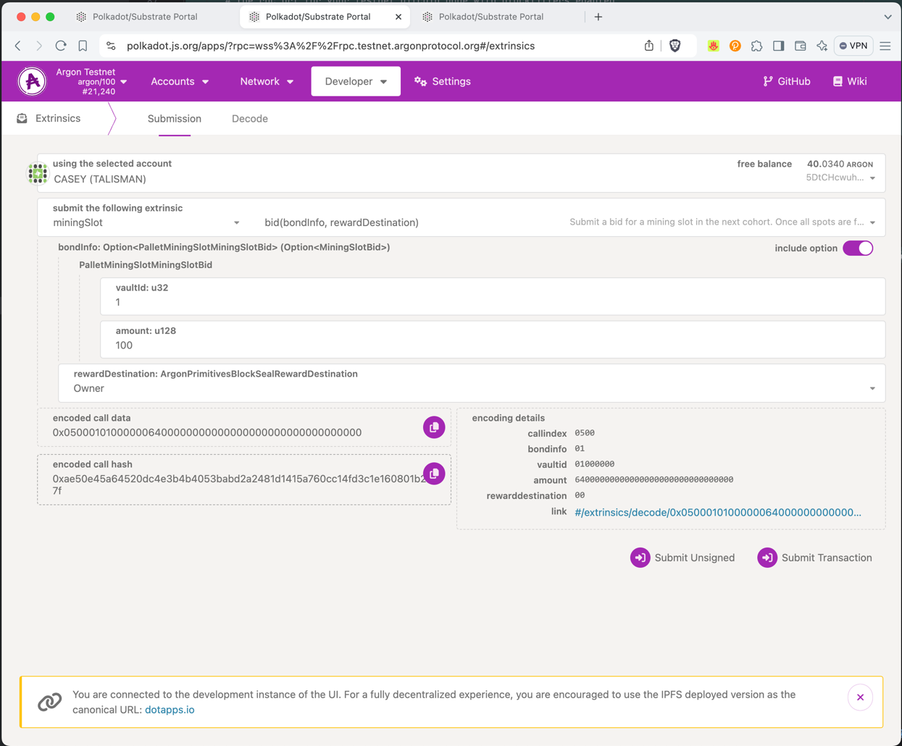
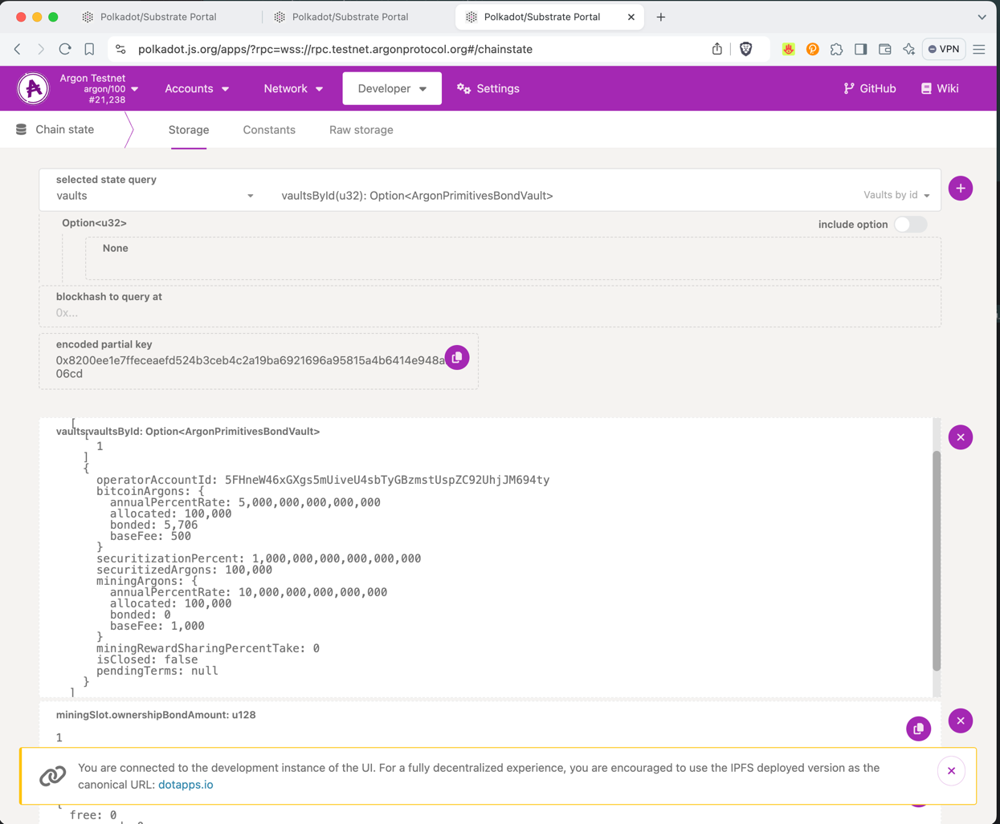
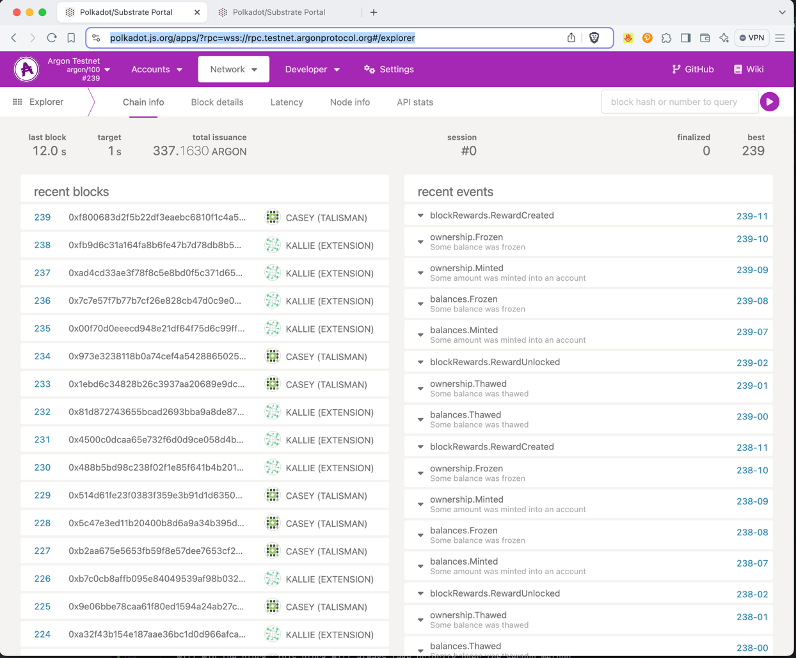
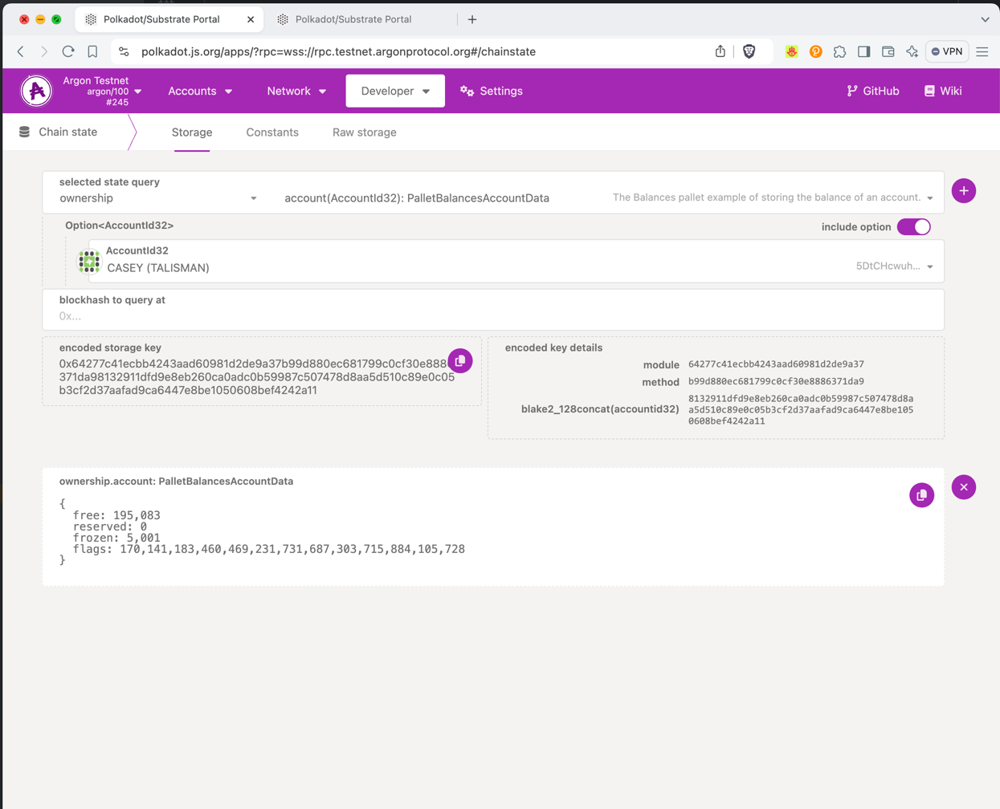

# Running a Miner

In this guide, we will walk through the steps to run a miner on the Argon network.

You'll learn how to:

1. Setup a miner machine
2. Acquire Argons and Ownership Tokens
3. Bid for a Mining Slot
4. Start mining and watch for rewards
5. Learn other Mining Rules

## 1. Setup a Miner Machine

### Minimum Server Requirements

Operating System: Ubuntu 22.04

CPU: 4x vCPU
Memory: 8 GB
Storage: 80 GB with ability to grow if needed. You need 500GB+ if you will keep a bitcoin full node without pruning,
30GB after you prune down.

### Node Setup

You need the following software installed/accessible. There is
an [Ansible playbook](https://github.com/argonprotocol/argon-ansible) available to help with this setup. For this guide,
we'll show some of the high-level steps.

#### Node Setup 1. Ntp

An NTP client to keep your system clock in sync with the network. You can install NTP with the following commands:

```bash
sudo apt-get install ntpsec
sudo ufw allow 123/udp
sudo nano /etc/ntp.conf
```

Replace the `server` lines with:

```
 server 0.pool.ntp.org iburst
 server 1.pool.ntp.org iburst
 server 2.pool.ntp.org iburst
 server 3.pool.ntp.org iburst
```

### Node Setup 2. Bitcoin Node

A Bitcoin node that supports Compact Block Filters. You do not need to keep block history - you can prune up to blocks
as of Jan 15, 2025. You can reference
the [Bitcoin Core installation guide](https://bitcoin.org/en/full-node#linux-instructions) for Ubuntu.

> You can install this on the same machine, but do note it will take up a few GB of storage. If you install it on
> another machine, modify your bitcoin.conf as appropriate.

#### Mainnet

Your bitcoin.conf must include the following configs:

```bash
chain=main
blockfilterindex=1
server=1
[main]
rpcauth={{ bitcoin_rpcauth }}
rpcport=8332
rpcbind=127.0.0.1
rpcallowip=127.0.0.1/0
```

---
NOTE: this does not exclude other configs you may need to run your bitcoin node. We are pruning by default in our own
[setup](https://github.com/argonprotocol/argon-ansible/tree/main/roles/bitcoin/templates/bitcoin.conf.j2).

#### Testnet

If you're connecting to the Argon Testnet, you'll need to connect to the Signet network.

Your bitcoin.conf must include the following configs:

```bash
chain=signet
blockfilterindex=1
server=1
[signet]
rpcauth={{ bitcoin_rpcauth }}
rpcport=18332
rpcbind=127.0.0.1
rpcallowip=127.0.0.1/0
signetchallenge=0014df6edb04cb5d8de5b15a63bdf5883f2eb6678b88
signetseednode=bitcoin-node0.testnet.argonprotocol.org:38333
```

### Node Setup 3. The Argon software

The Argon software. You can find the latest release on the [releases page](
https://github.com/argonprotocol/mainchain/releases/latest). You're looking for a file
named `argon-node-v<VERSION>-x86_64-unknown-linux-gnu.tar.gz`. Download it to your server. You probably want to
set
this up as a systemd service on your own server. The ansible playbook will do this for you.

You can also use the docker image published on
the [GitHub Container Registry](https://github.com/argonprotocol/mainchain/pkgs/container/argon-miner).

**Network (libp2p) Identity File**
You'll need to create an identity file for your node. Internally, Argon uses [libp2p](https://libp2p.io) to
discover and
connect to the decentralized network. You can generate a libp2p identity with the following command:

```bash
 ./argon-node key generate-node-key --file /home/argon/argon-node.key
```

**Notebook Archives**
You need to connect to a notebook archive for your environment. This is an s3 compatible host that stores notebooks for
all notaries. You can set this with the `--notebook-archive-hosts` flag. You can create your own host by downloading the
existing notebooks and hosting them on your own s3 compatible host (minIO is an open source option).

Here are some examples:

- Argon Foundation Archive: `https://notebook-archives.argon.network`
- Testnet Archive: `https://testnet-notebook-archive.argonprotocol.org`

**Start Script**
You need to launch your node with configurations to connect to the Argon Testnet.

   ```bash
   NOTEBOOK_ARCHIVES="https://notebook-archives.argon.network"
   ./argon-node --validator \
      --name "Your Node Name" \
      # Control the data location for your node
      # --base-path /path/to/your/node/data \
      # or a path to your testnet chain spec
      --chain testnet \
      # one or more archive host for the notebooks
      --notebook-archive-hosts=$NOTEBOOK_ARCHIVES \
      # the rpc url for your signet bitcoin node with blockfilters enabled
      --bitcoin-rpc-url="http://bitcoin:<ENCODED_PASS>@127.0.0.1:38332" \
      # allow rpc on your local host only by default
      --rpc-port 9944 \
      # don't connect to local peers
      --no-mdns \
      # add detailed logs
      --detailed-log-output \
      # your node identity file for connecting to the network
      --node-key-file /home/argon/argon-node.key
   ```

**Session Keys:**
Once your node is up (the first time ONLY), you need to create session keys for your node. You can do this
with the following command:

```bash
   curl -H "Content-Type: application/json" -d '{"id":1, "jsonrpc":"2.0", "method": "
author_rotateKeys"}' http://localhost:9944/
```

> NOTE: you must keep the output of this command for your mining registration.

## 2. Acquire Argons and Argonots (Ownership Tokens)

Mining requires you to have two tokens: Argons and Argonots (Ownership Tokens). There are initially 100 mining slots
available in
Argon, each lasting 10 days. So every day, you are bidding for 1 of 10 available slots. This will grow to 10,000 slots
as the network grows. Bidding will continue until a random block less than or equal to 200 blocks before the next slot
begins (slots start every 1440 blocks).

At any given time, a mining slot requires you to own and lock 1/100th (or current mining slots) of the total Ownership
Tokens in circulation. And you can (optionally) put yourself ahead of someone else on the list by bidding more Argons
than they have. You will get these Argons back at the end of the slot (or if you lose your bid). Argons rented for this
process must come from a [Vault](./running-a-vault#mining-bonds).

Vault Argons are allowed to be rented for mining bonds at a ratio of 3:1 with the Bitcoins bonded in a vault, capped by
the amount of securitization locked up by the vault. In other words, if a vault has 100k of bitcoin and 200k of
securitization in the vault, the vault is able to offer up to 300k of mining bonds. If
there is 0 securitization, then only 100k of mining bonds are eligible. A vault offers an allocated amount of both
Bitcoin and Mining bonds. You can view a vault's current allocation by looking at the Chain State in Polkadot.js under
`Vaults -> VaultsById`, and then viewing `allocated` and `bonded` amounts of each. Some Vault operators will also offer
profit sharing terms, where you don't need to rent Argons for as high a cost, but will need to share argons minted
during your slot.

You need to set up an account and acquire Argons to bid for a mining slot.

### Mainnet Funds

You can acquire Mainnet argons and argonots by buying them off of decentralized exchanges like Uniswap, or earning them
during the first 10 days of mining (this time before Bidding begins is referred to as Slot Zero).

### Testnet Funds

In testnet, you can do this by following the steps in
the [Argon Faucet Guide](./account-setup.md#requesting-testnet-funds).

You'll also need to acquire Ownership Tokens. Once Argon is live, you will buy these off of decentralized like Uniswap,
or earn them during the first 10 days of mining (this time before Bidding begins is referred to as Slot Zero). In the
Testnet you can request Argons using a Discord bot just like
the [Argon Faucet](./account-setup.md#requesting-testnet-funds), but you'll use the slash following command instead:

```bash
/drip - ownership [address]
```

## 3. Bid for a Mining Slot

Now that you have an account with Argons and Argonots (Ownership Tokens), you can bid for a mining slot. You're bidding
for a 10- day period starting at the next block that is divisible by 1440 blocks (eg, every 1440 blocks from the genesis
block). Mining bids close in a randomly chosen block within 200 blocks of the next slot. Mining bids begin
after a 10-day bootstrap period called "Slot Zero".

> NOTE: in the Testnet, you can start bidding right away.

There are initially 10 mining positions available every "slot", and 100 total miners at genesis. Each slot will last 10
days, so at any given time, there are 10 overlapping cohorts of miners. Each day, 1/10th will rotate out and 1/10th will
rotate in. Over time, the number of miners will increase to 10,000.

You are bidding for a slot, and can be outbid at any time by someone who "locks" more Argons than you. You can monitor
if you currently have a winning slot by looking at
the [Chain State](https://polkadot.js.org/apps/?rpc=wss://rpc.testnet.argonprotocol.org#/chainstate)
under **miningSlot** -> **nextSlotCohort**. If you are in the nextSlotCohort, you have a winning bid. You can also
monitor for events in
each block matching `SlotBidderReplaced` to see if you have been outbid. (Events can be monitored programmatically using
the `@argonprotocol/mainchain` node.js library, or using the `argon-client` rust library, which is
a [`subxt`](https://github.com/paritytech/subxt) based rust library).

To submit your bid, you'll need to submit the signing keys you'll use for the slot. These are the keys you generated
when
you created your node [here](#node-setup-3-the-argon-software) -> Session Keys. You'll submit these as your keys in the
mining bid. NOTE: If you want to more carefully create and backup your keys, you can also generate them individually as
shown [here](https://docs.substrate.io/tutorials/build-a-blockchain/add-trusted-nodes/).

You can bid for a slot by using the Polkadot.js
interface [here](https://polkadot.js.org/apps/?rpc=wss://rpc.testnet.argonprotocol.org#/extrinsics/decode/0x06000100000000000000000000000000000000000000000000000000000000000000000000000000000000000000000000000000000000000000000000000000000000000000000000000000000000000000000000000000).
If you toggle to "Submission", you can submit your bid.


> NOTE: you'll want to review the Vaults and the terms they are offering for renting the Argons you want to bid with.
> That's available at Developer -> Chain State -> Vaults -> Vaults.
> 

### 4. Start Mining and Watch for Rewards

Once you have successfully bid for a mining slot, you can start mining. You will win blocks with an average equal split
with however many other active miners there are. A miner wins blocks in two ways:

1. Your node is selected as the XOR closest node to a block vote submitted in a notebook for the current tick. The miner
   with the closest XOR distance of their Authority ID (the key you registered as a *BlockSealAuthority Key*) to the
   block vote key will win the block. This block will always take priority over the second method.
2. Your node solves a Proof of Compute (RandomX) hash that is less than the current difficulty target. These blocks are
   considered "secondary" and will only be included if no primary block is available. You can fill in as many "compute"
   blocks as you want, but you will only get rewards if you are able to include new Notebooks in the block.

You can monitor your mining rewards by checking
the [Block Explorer](https://polkadot.js.org/apps/?rpc=wss://rpc.testnet.argonprotocol.org#/explorer) and watching for
blocks created by your account.


Your rewards will consist of Argons and Ownership Tokens. Rewards start at 5 Argons and 5 Ownership Tokens per block,
and will decrease by half ever 2.1 million blocks (blocks are on average every minute). You can view your accumulated
Ownership tokens using
the [Chainstate](https://polkadot.js.org/apps/?rpc=wss://rpc.testnet.argonprotocol.org#/chainstate) tab in Polkadot.js
and looking up `Ownership -> Accounts (your account)`.


### 5. Learn other Mining Rules

## Phases

### Slot Zero

The first phase of mining is a compute phase. Compute mining uses Randomx to solve a hash that is less than the current
difficulty target. This phase will last 10 days to bootstrap the network.

### Slot Bidding

After this point, there are 10 mining slots per day (each lasting 10 days). To bid for a mining slot, the account you
register as a miner must possess 1/100th of the total Ownership Tokens in circulation (this amount moves up and down
based on a target number of miners applying for the slots). These variables can be found in the mining_slot pallet:

- `TargetBidsPerSlot`: the current number of bids per slot that are targeted (20% more than slots available)
- `HistoricalBidsPerSlot`: the number of bids per slot over the recent history
- `OwnershipBondAmount`: the total number of Ownership Tokens needed to bid for a slot
- `NextSlotCohort`: the currently slotted miners for the slot ending tomorrow

#### Slot Bid End-time

Slot bidding is for the next slot, and the end time is a random block within 200 blocks of the next slot. Randomization
is determined from the block "seal" used to close a block. You can see if bidding has closed by looking at the
`IsNextSlotBiddingOpen` variable in the mining_slot pallet.

## Block Rewards

Block rewards are given for each closed block as both Argons and Ownership Tokens. Rewards are scaled by the number of
notebooks included in a block vs the active notaries. If no current notebooks are included, the block reward is only 1
microgon (eg, you are mostly just earning fees).

Block rewards start at 0.5 Argons and 0.5 Ownership Tokens per block, and increase by 1 milligon (1/10th of an Argon)
every 118 blocks. This will continue until the block reward reaches 5 Argons and 5 Ownership Tokens per block. After
this point, the Ownership Tokens will become deflationary, with the block reward halving every 2.1 million blocks.
Argons are currently slated to stay level, but we anticipate a future model where Argons are related to the total
circulation to ensure sustainable economic security.

### Reward Maturation

Block rewards are not immediately available. They are frozen and released after 5 blocks.

### Profit Sharing

If you are renting Argons from a Vault, you may have a profit-sharing agreement. This will be a percentage of the Argons
minted during your slot. You can view the profit-sharing agreement in the Chain State under `Vaults -> VaultsById`. The
percent will be allocated during block reward creation.

### Vote Creator

When you are a bid-winning miner, you are processing "votes" for which block to follow that are produced by any Argon
holder who has accumulated "tax" on their Argons. Tax is created when you send Argons via a Localchain or when you
settle a payment channel via a Localchain. The miner with the mining authority key closest in XOR distance to the vote
will be selected to create the block. This vote creator will be rewarded with 25% of the block rewards.

## Max Blocks Per Tick

Up to 60 blocks can be created per tick (this is only relevant to the compute phase). Only a single block can be created
per tick with a mining slot. The 60th block per tick must have notebooks included to be accepted.

## Block Priority

During compute mining, the best block will be the block with the highest aggregate difficulty. During the vote creator
phase, the block sorting is as follows:

1. If a vote block, the block with the most notebooks
2. The most voting power (aka, the most notebooks included with votes. The power is the aggregate argons spent on the
   votes)
3. Vote blocks are preferred over compute blocks
4. The strongest seal strength (aka, the smallest vote proof hash, whose calculation can be found in the
   `block_seal::find_vote_block_seals`)
5. Finally, the block with the most aggregate compute difficulty
