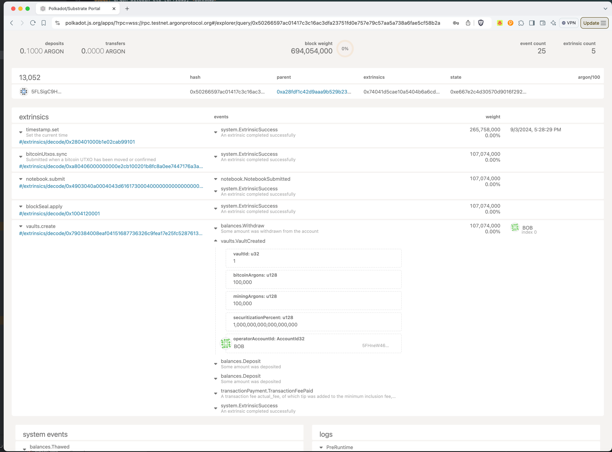

# Bitcoin Vaults

Vaults are a core part of the Argon network. They lend Argons to both Bitcoin holders and Miners. For Bitcoin bonders,
Vaults commit to lock up the market value of Bitcoin in Argons for a year. A Vault may choose the Annual Percentage
Rate (APR) per Argon they charge for this service.

## Bitcoin Bonds

A Bitcoin Bond is a one-year commitment to lock up the market value of Bitcoin in Argons. These funds are not at risk as
long as a Vault performs the following two functions:

1. A Vault acts as a co-signer for a Bitcoin UTXO that is locked in Argon. The Vault must respond to requests to co-sign
   Bitcoin Unlocks within 10 days, or they will forfeit funds. NOTE: a Vault must perform this function for a full year
   from the last Bitcoin they allow to be bonded. In other words, a Vault commits to remaining operational for up to one
   year past when they "_close_" the vault.
2. A Vault must never move a Bitcoin on the Bitcoin network without unlocking first on Argon (ie, collude with the
   Bitcoin holder to bypass Argon). If they do so, they will forfeit funds.

### Variables for Bitcoin Bonds

- `Annual Percentage Rate (apr)`: An annual percentage rate charged per argon for the service of locking up Bitcoin.
  The Satoshi value in Argons is calculated by using prices of Bitcoin and Argon in USD. The APR multiplied by the argon
  value to determine the yearly fee.
- `Base Fee`: A flat fee charged for the service of locking up Bitcoin.
- `Securitization Percent`: The percentage (of offered _Bitcoin Argons_) the Vault is willing to put up to cover the
  loss of Bitcoins in case of fraud. These funds are not eligible for bonds, but allow a Vault to offer an equivalent
  amount of Mining Bonds (up to 2x the Bitcoin BondedArgons).
- `Bitcoin Argons`: The number of argons a Vault will offer for Bitcoin Bonds. Once an argon is locked for the year, it
  will not be returned to the Vault until the bond is complete.

## Mining Bonds

A Mining Bond lasts only for the duration of a Mining Slot (10 days). A Vault can rent out up to 2x the amount of
Bitcoin BondedArgons in Mining Bonds. The Vault does not need to perform any actions to maintain their Mining Bonds.
These are completely not at risk.

### Variables for Mining Bonds

- `Annual Percentage Rate (apr)`: An annual percentage rate that is charged at 10 days worth of blocks (10/365) times
  the amount of Argons a miner wishes to submit for their mining bid.
- `Base Fee`: A flat fee charged for the service of locking up Argons for a Mining Bond. This fee is most relevant to
  Mining Bonds so that a Vault cannot be "gamed" by a miner submitting and cancelling a large number of Mining Bonds.
- `Mining Reward Sharing Percent Take`: A Vault can optionally offer a very low percentage rate for a Mining Bond in
  exchange for profit sharing on any minted Argons during the Mining Slot. This can be an appealing offer for miners so
  they don't have to try to predict an optimal bid that will out-pace the slot earnings (eg, by looking at the pattern
  of previous slots and hoping the demand for new argons remains the same or above).
- `Mining Argons`: The number of argons a Vault will offer for Mining Bonds. Once an argon is locked for the 10 days, it
  will not be returned to the Vault until the bond is complete.

## The Argon Bitcoin CLI

Argon publishes a CLI that allows Bitcoin bonders and Vault operators to simplify their operations on the Argon network.

> This will ultimately be replaced by an app interface, so feedback on the flow would be appreciated when testing the
> CLI.

You can find the latest release on the [releases page](https://github.com/argonprotocol/mainchain/releases/latest).

```bash
$ argon-bitcoin-cli --help
A cli used to bond bitcoins, create and manage Vaults

Usage: argon-bitcoin-cli [OPTIONS] <COMMAND>

Commands:
  vault  List, create and manage vaults
  bond   Create, unlock and monitor bonds
  xpriv  Create, secure, and manage your Bitcoin Master XPriv Key
  utils  Utilities for working with Bitcoin and Argon primitives
  help   Print this message or the help of the given subcommand(s)

Options:
  -t, --trusted-rpc-url <TRUSTED_RPC_URL>  The argon rpc url to connect to [env: TRUSTED_RPC_URL=] [default: ws://127.0.0.1:9944]
  -h, --help                               Print help
  -V, --version                            Print version
```

The `utils` commands are particularly useful for working with Polkadot.js for converting complex numbers (such as when
creating a vault).

NOTE: you must convert an Xpub from the Electrum interface into something the Polkadot.js interface can understand. You
can use the `utils` command to do this.

```bash
$ argon-bitcoin-cli utils encode-xpub tpubD8t2diXwgDwRaNt8NNY6pb19U3SwmUzxFhFtSaKb79cfkPqqWX8vSqPzsW2NkhkMsxye6fuB2wNqs5sGTZPpM63UaAb3e69LvNcFpci6JZt
```

## Choosing a Network

You'll note that all the urls and examples in this doc use the testnet. Please replace
`wss://rpc.testnet.argonprotocol.org` with a trusted mainnet rpc url if you are using the mainnet. The testnet won't let
you submit mainnet bitcoins, so you can't accidentally lose your funds, but you can lose a lot of time :). NOTE: if you
share a key across both environments, you WILL invoke these actions against the network.

You can also set an environment variable and omit the parameters by setting `export TRUSTED_RPC_URL=<URL>` to the url
you'd like to
use.
Some example urls:

- Argon Foundation RPC: `wss://rpc.argon.network`.
- Testnet: `wss://rpc.testnet.argonprotocol.org`.

```bash
 export TRUSTED_RPC_URL=wss://rpc.argon.network
```

## Creating a Vault

To create a vault, you can use the CLI to create a new vault with the terms you'd like to offer. The CLI will generate a
url that will allow you to complete the creation process on the Polkadot.js interface. It will also tell you how many
Argons need to be in your account to create the Vault.

### 1. Create a new master XPriv key

You'll need to supply the Argon Mainchain with your Bitcoin XPub key. This is a public key that allows the Argon network
to generate addresses for your Bitcoin UTXOs. You'll want to rotate this out occasionally as a security measure.

Your first step is to create a master XPriv key. This is a private key that will allow you to derive 1+ XPub master keys
that you'll upload to Argon. As long as you derive hardened master XPubs (more in next step), your key is impossible to
uncover through the vault activities.

> Aside: this flow shows creating an XPriv key in the CLI. The flow and apps will be enhanced to use Hardware Keys and
> secure storage like the Secure Enclave on a Mac or iPhone. However, for now you will need to manage your XPriv key as
> a password encrypted file.

```bash
$ argon-bitcoin-cli xpriv master --password=supersecret --xpriv-path=/tmp/vault1.xpriv -t wss://rpc.testnet.argonprotocol.org
```

### 2. Create an upload-able XPub key

Now you need to generate an XPub key that will be used in the Argon mainchain to auto-generate two normal public keys
for each Vaulted Bitcoin. One of those public keys will be to cosign unlock requests with the bitcoin owner, and one is
to claim the bitcoin if the owner never unlocks the bitcoin. These details will be retrievable during the steps you need
them.

You _do_ need to keep track of your XPriv key and password, in addition to the HD Path you use to generate the master
XPub. During a switch of keys, you'll need to pay close attention to _which_ master XPub was used for a request (and
internally, which hd path you need to provide to the cli). Let's generate the XPub key.

> NOTE: you need to use a unique HD path everytime you create a new XPub key, and ideally at the same "level" as the
> previous one, so you don't accidentally overlap keys. The last part of the path also needs to be hardened to ensure
> the key is secure.

```bash
$ argon-bitcoin-cli xpriv derive-xpub --xpriv-path=~/.xpriv/vault1.xpriv --password=supersecret --hd-path="m/84'/0'/0'"
```

### 3. Create a Vault

Use the xpub that was generated in the previous step to create a new vault. You can set the terms of the vault to
whatever you'd like to offer.

```bash
$ argon-bitcoin-cli vault create --trusted-rpc-url wss://rpc.testnet.argonprotocol.org \
  --mining-apr=1% --mining-base-fee=₳1.00 --mining-argons=₳100 \
  --bitcoin-apr=0.5% --bitcoin-base-fee=₳0.50 --bitcoin-argons=₳100 \
  --securitization-percent=100% --mining-reward-sharing-percent-take=0% \
  --bitcoin-xpub=tpubD8t2diXwgDwRaNt8NNY6pb19U3SwmUzxFhFtSaKb79cfkPqqWX8vSqPzsW2NkhkMsxye6fuB2wNqs5sGTZPpM63UaAb3e69LvNcFpci6JZt
```

This will output a URL that you can use to complete the transaction on the Polkadot.js interface. When you load this
URL, you can click over to `Submission` to submit the transaction.

```bash
Vault funds needed: ₳300
Link to create transaction:
https://polkadot.js.org/apps/?rpc=wss://rpc.testnet.argonprotocol.org#/extrinsics/decode/0x07000f0080e03779c311d1070f0000c16ff28623a10f00821a0600045f1cf601459bf4948000000025df6a795c9c2f021f1b826157957c53ec219754d7bc19d4875f26ec3d8cdad8030a1c14c2ab00f5fd06dc8fbf41ab7b5323290203a78444d4f20e5ecc5b98f25d821a060013000064a7b3b6e00d
```


Once your vault is created, you can look at the block it was included in to see what Vault Id you were assigned.



## Monitoring Unlock Requests

As a Vault operator, you need to monitor the Argon mainchain for Bitcoin Unlock requests. The simplest option is to use
the CLI to monitor the mainchain for these requests.

```bash
$ argon-bitcoin-cli vault pending-unlock --vault-id=1 --trusted-rpc-url wss://rpc.testnet.argonprotocol.org
Pending as of block #15167

NOTE: does not include eligible for reclaim by vault.

╭─────────┬─────────┬──────────────────────┬────────────────┬──────────────────╮
│ Bond Id ┆ Utxo Id ┆ Expiration Due Block ┆ Type           ┆ Redemption Price │
╞═════════╪═════════╪══════════════════════╪════════════════╪══════════════════╡
│ 1       ┆ 1       ┆ 2903776              ┆ Cosign Request ┆ ₳2.80            │
╰─────────┴─────────┴──────────────────────┴────────────────┴──────────────────╯
```

## Cosigning Unlock Requests

When you see a Bitcoin Unlock request, you need to cosign the request to allow the Bitcoin to be unlocked. You can use
the CLI to cosign the request.

### 1. Provide your cosignature

When you encounter a Bitcoin Unlock request, you will need to know:

1. The `BondId` - looked up in the previous step
2. The `XPriv Path` and `Decryption Password` - used to generate the XPub key
3. The `HD Path` used to create the master XPub key that was used by Argon to generate this bitcoin cosign script.

```bash
$ argon-bitcoin-cli bond vault-cosign --bond-id=1 \
  --xpriv-path=~/.xpriv/vault.xpub --password=supersecret --hd-path="m/84'/0'/0'" \
  --trusted-rpc-url wss://rpc.testnet.argonprotocol.org
```

### 2. Complete the transaction in Polkadot.js

This will output a URL that you can use to complete the transaction on the Polkadot.js interface. It will provide your
half of the co-signature to the Bitcoin Unlock request, and you have now fulfilled all your duties for this Bitcoin
bond.

## Reclaiming Bitcoin

If you get to the end of the year and the Bitcoin owner has not requested an unlock in Argon, you will lose possession
of the bonded argons. As compensation, you can claim the Bitcoin.

### 1. Sign the "Claim Bitcoin" Partially Signed Bitcoin Transaction

You'll need to provide a destination script pubkey to send the Bitcoin to. You can also submit the fee rate (sats/vbyte)
you'd like to use for the transaction. You can find current rates here: https://mempool.space/testnet.

```bash
$ argon-bitcoin-cli bond claim-utxo-psbt --bond-id=1 \
  --xpriv-path=~/.xpriv/vault.xpub --password=supersecret --master-xpub-hd-path="m/84'/0'/0'" \
  --dest_pubkey=tb1q3hkkt02k975ddxzeeeupy9cpysr2cy929ck4qp \
  --trusted-rpc-url wss://rpc.testnet.argonprotocol.org
```

This will output a psbt string you can import into bitcoin-core or another wallet that supports PSBTs. Here's an example
of where you can import (and broadcast) into Electrum:

